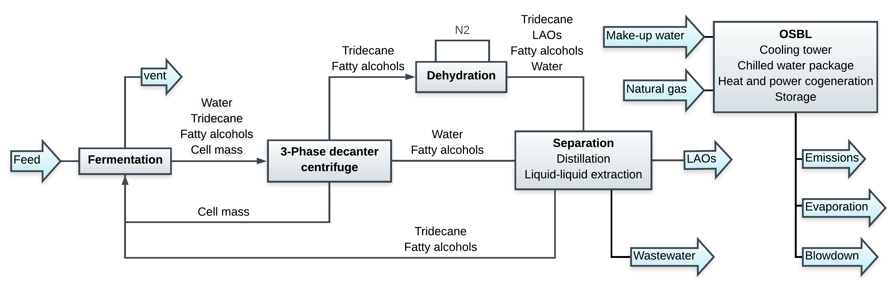

======================================================================
LAOs: Production of Linear-Alpha Olefins from Renewable Fatty Alcohols
======================================================================

The biorefinery design for the production of linear-alpha olefins (LAOs)
follows all assumptions from a study by McClelland et. al. [1]_. A mixture of 
glucose, growth nutrients, water, and tridecane is mixed and fed to 
fermentation. The fermenter effluent is sent to a 3-phase decanter centrifuge 
to separate the oil, aqueous, and cell mass fractions. The cell mass is 
partially recycled to the fermenter, the oil fraction is sent to dehydration, 
and the aqueous fraction is sent to the separation to recover fatty alcohols by 
liquid-liquid extraction. The effluent of the dehydration section sent to the 
separation section to recover the LAOs by distillation. OSBL unit operations 
include storage, a cooling tower, a chilled water package, and heat and power 
cogeneration.

Getting Started
---------------

To load the biorefinery, simply import it. All data and variables
are lazy loaded by the module:

.. code-block:: python

    >>> from biorefineries import LAOs as laos
    >>> # This is optional; it forces the biorefinery to load
    >>> # Otherwise, first time accessing will take a bit to load.
    >>> laos.load()
    >>> laos.chemicals # All chemicals used by the biorefinery.
    CompiledChemicals([HCl, Methane, Water, Acetone, LacticAcid, PhosphoricAcid, Tridecane, Ethanol, Butanol, Hexanol, Octanol, Decanol, Dodecanol, Tetradecanol, Hexadecanol, Hexene, Octene, Decene, Dodecene, Tetradecene, Hexadecene, P4O10, SO2, N2, O2, CO2, Glucose, NaCl, DiammoniumPhosphate, CornSteepLiquor, Ash, Cells, Gliadin, CellExtract, Tryptone])
    >>> laos.LAOs_sys.show() # The complete biorefinery system
    System: LAOs_sys
     path: (tridecane_recycle, H108, D103,
            D104, H106, H107, H108, T108,
            T109, T110)
     facilities: (CWP, BT, CT, BT, CCI)
    >>> laos.LAOs_tea.show() # The TEA object
    CombinedTEA: LAOs_sys, Area700
     NPV: -79,822 USD at 10.0% IRR
    >>> laos.flowsheet # The complete flowsheet
    <Flowsheet: LAOs>
    >>> laos.R101.show() # Any unit operations and streams can be accessed through the module
    FattyAlcoholBioreactor: R101
    ins...
    [0] mixed_bioreactor_feed  from  HXutility-H101
        phase: 'l', T: 310.15 K, P: 101325 Pa
        flow (kmol/hr): Water                1.87e+04
                        Tridecane            366
                        Hexanol              4.51
                        Octanol              0.998
                        Decanol              0.231
                        Hexene               0.124
                        Octene               0.0275
                        ...
    outs...
    [0] CO2
        phase: 'g', T: 310.15 K, P: 101325 Pa
        flow (kmol/hr): CO2  641
    [1] d394  to  StorageTank-T105
        phase: 'l', T: 310.15 K, P: 101325 Pa
        flow (kmol/hr): Water                1.92e+04
                        Tridecane            366
                        Hexanol              41
                        Octanol              29.6
                        Decanol              70.8
                        Hexene               0.124
                        Octene               0.0275
                        ...

References
----------
.. [1] McClelland D.J., Wanga B.X., Cordella W., Cortes-Peña Y., 
    Gilchera E.B., Zhang L., Guest J.S., Pflegera B.F., Huber G., and Dumesic 
    J.A. Renewable Linear Alpha-Olefins by Base-Catalyzed Dehydration of 
    Biologically-Derived Fatty Alcohols. 2020. In Preparation.

