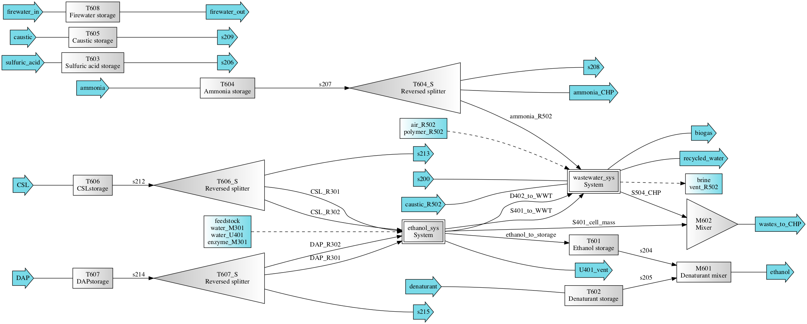

=====================================================================================
ethanol_adipic: Production of Ethanol and Adipic Acid from Lignocellulosic Feedstocks
=====================================================================================

Simplified process flow schemes
-------------------------------

.. figure:: ./images/acid_pretreatment_biorefinery.png

    Acid-pretreatment biorefinery

    AFEX-pretreatment biorefinery

.. figure:: ./images/base_pretreatment_biorefinery.png

    Base-pretreatment biorefinery

This module contains several options for preprocessing and pretreatment of
lignocellulosic biomass. Preprocessing options at biomass depot can be either
conventional or high-moisture pelleting process (CPP/HMPP). Pretreatment of the
feedstocks can be ammonia fiber expansion (AFEX, at the biomass depot), acid
(dilute sulfuric acid, at the biorefinery), or base (deacetylation and mechanical
refining, DMR, at the biorefinery).

Carbohydrates in these biorefineries are converted to ethanol; unconverted
carbohydrates and lignin in all biorefineries can be burned in the boiler for
energy production. When AFEX- and base-pretreatment are used, it is also
feasible to include a process to convert those into adipic acid (default).

Getting Started
---------------

First choose which system configuration to load, the default is acid-pretreatment
biorefinery preprocessed by HMPP.

.. code-block:: python

    >>> from biorefineries import ethanol_adipic as ea
    >>> ea.load_system('acid', 'HMPP')
    >>> # Once loaded, you can have a quick glance of the results
    >>> # Note that the first simulation will take a longer time
    >>> ea.simulate_and_print()
    
    ---------- Acid Biorefinery ----------
    MESP: $3.15/gal
    GWP: -0.392 kg CO2-eq/gal ethanol without feedstock
    --------------------------------------
    >>> ea.chems.show()
    CompiledChemicals([H2O, O2, N2, CH4, CO, CO2, NH3, NO, NO2, H2S, SO2, H2, H2SO4, HNO3, NH4OH, CalciumDihydroxide, AmmoniumSulfate, NaNO3, CaSO4, NaOH, Na2SO4, DAP, AceticAcid, Glucose, GlucoseOligomer, Extractives, Xylose, XyloseOligomer, Sucrose, Cellobiose, Mannose, MannoseOligomer, Galactose, GalactoseOligomer, Arabinose, ArabinoseOligomer, SolubleLignin, Protein, Enzyme, FermMicrobe, WWTsludge, Furfural, HMF, Xylitol, LacticAcid, SuccinicAcid, Ethanol, Glycerol, P_putida, P_putidaGrow, Denaturant, AdipicAcid, MuconicAcid, MonoSodiumMuconate, Acetate, AmmoniumAcetate, Glucan, Mannan, Galactan, Xylan, Arabinan, Lignin, P4O10, Ash, Tar, CSL, BoilerChems, Polymer, BaghouseBag, CoolingTowerChems])
    >>> # To load the alternative configuration, you can just use the load_system function
    >>> ea.load_system('AFEX', 'CPP_AFEX')
    >>> # Note the default GWP doesn't include impacts from feedstocks,
    >>> # you can include feedstock impacts by indicating the which depot
    >>> # configuration is used for feedstock preprocessing
    >>> ea.simulate_and_print('CPP_AFEX')
    
    ---------- AFEX Biorefinery ----------
    MESP: $2.82/gal
    GWP: -3.597 kg CO2-eq/gal ethanol without feedstock
    GWP: -1.435 kg CO2-eq/gal ethanol with feedstock
    --------------------------------------

Systems
-------
The `Flowsheet`, `System`, and `TEA`, objects are `flowsheet`, `tea`, and `biorefinery`, respectively.

Naming conventions:
    D = Distillation column
    
    F = Flash tank
    
    H = Heat exchange
    
    M = Mixer
    
    P = Pump
    
    R = Reactor
    
    S = Splitter (including solid/liquid separator)
    
    T = Tank or bin for storage
    
    U = Other units
    
    PS = Process specificiation, not physical units, but for adjusting streams

Processes:
    100: Feedstock preprocessing
    
    200: Pretreatment
    
    300: Carbohydrate conversion
    
    400: Carbohydrate product separation
    
    500: Wastewater treatment
    
    600: Facilities
    
    700: Lignin conversion and separation

.. code-block:: python

    >>> # You can directly access the Flowsheet, System, and TEA objects
    >>> ea.flowsheet
    <Flowsheet: acid>
    >>> ea.biorefinery.show()
    System: biorefinery
     path: (pretreatment_sys, ethanol_sys,
            wastewater_sys, T601, T602, M601,
            T603, T604_S, T604, T605, T606_S,
            T606, T607_S, T607, T608, M602, T610)
     facilities: (CHP, CT, PWC, ADP, CIP, BDM)
    >>> ea.tea.show()
    CombinedTEA: biorefinery, CHP_sys
     NPV: -538 USD at 10.0% IRR
    >>> # You can use the flowsheet to access streams, unit operations, and subsystems
    >>> u = ea.flowsheet.unit
    >>> u.R301.show()
    SaccharificationAndCoFermentation: R301
    ins...
    [0] s347  from  EnzymeHydrolysateMixer-M301
        phase: 'l', T: 346.79 K, P: 101325 Pa
        flow (kmol/hr): H2O                1.96e+04
                        NH4OH              3.76
                        AmmoniumSulfate    18.8
                        DAP                0.981
                        AceticAcid         20.6
                        Glucose            19.7
                        GlucoseOligomer    0.54
                        ...
    [1] s348  from  SeedHoldTank-T301
        phase: 'l', T: 305.15 K, P: 101325 Pa
        flow (kmol/hr): H2O                2.16e+03
                        NH4OH              0.417
                        AmmoniumSulfate    2.09
                        DAP                0.43
                        AceticAcid         2.28
                        Glucose            0.832
                        GlucoseOligomer    0.78
                        ...
    [2] CSL_R301  from  ReversedSplitter-T606_S
        phase: 'l', T: 298.15 K, P: 101325 Pa
        flow (kmol/hr): CSL  29.6
    [3] DAP_R301  from  ReversedSplitter-T607_S
        phase: 'l', T: 298.15 K, P: 101325 Pa
        flow (kmol/hr): DAP  0.981
    outs...
    [0] R301_g  to  Mixer-M401
        phase: 'g', T: 305.15 K, P: 101325 Pa
        flow (kmol/hr): H2O           19.7
                        O2            4.68
                        CO2           411
                        AceticAcid    0.0406
                        Furfural      0.0225
                        HMF           0.00954
                        LacticAcid    1.13e-05
                        ...
    [1] effluent  to  Mixer-M402
        phase: 'l', T: 305.15 K, P: 101325 Pa
        flow (kmol/hr): H2O                1.94e+04
                        NH4OH              3.76
                        AmmoniumSulfate    18.8
                        DAP                2.07
                        AceticAcid         20.6
                        Glucose            2.91
                        GlucoseOligomer    7.02
                        ...
    [2] side_draw  to  SeedTrain-R302
        phase: 'l', T: 321.15 K, P: 101325 Pa
        flow (kmol/hr): H2O                2.16e+03
                        NH4OH              0.417
                        AmmoniumSulfate    2.09
                        DAP                0.449
                        AceticAcid         2.28
                        Glucose            16.6
                        GlucoseOligomer    0.78
                        ...

Analyses
--------
Work ongoing, coming soon...

