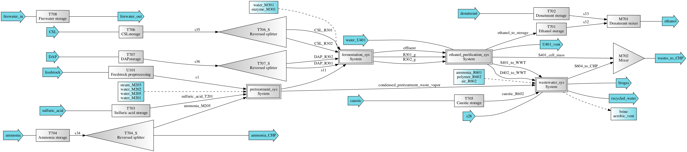
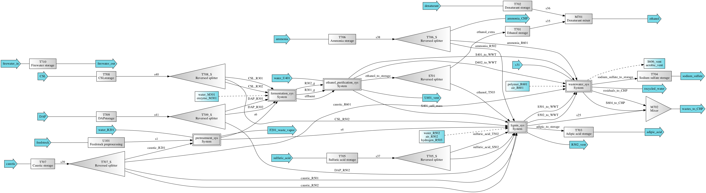

======================================================================
ethanol and ethanol_adipic: Tailored Pretreatment Processes for Production of Ethanol and Adipic Acid from Lignocellulosic Feedstocks
======================================================================

Simplified process flow schemes
-------------------------------
Acid-pretreatment biorefinery:

Base-pretreatment biorefinery:

The biorefineries are developed for a submitted manuscript [1] based on [2]
and [3] for the production of ethanol via acid-pretreatment (dilute sulfuric acid)
or base-pretreatment (deacetylation and mechanical refining, DMR), carbohydrate
fermentation, and ethanol purification processes from lignocellulosic biomass.
In the base-pretreatment biorefinery, adipic acid is generated from lignin
utilization (fermentation) process and sodium sulfate is generated from wastewater
treatment process (reverse osmosis). Part of the script is developed in [4].

Getting Started
---------------

Load the biorefineries by importing, the biorefinery systems will be automatically
simulated (first time accessing takes a bit to load the chemicals and system).

.. code-block:: python

    >>> from biorefineries.ethanol_adipic import system_acid as acid
    >>> # Acid-pretreatment biorefinery
    >>> from biorefineries.ethanol_adipic import system_base as base
    >>> # Base-pretreatment biorefinery
    >>> acid.chems
    >>> # All chemicals used in acid and base biorefineries, can also use base.chems
    CompiledChemicals([H2O, O2, N2, H2, CH4, CO, CO2, NH3, NO, NO2, H2S, SO2, H2SO4, HNO3, NaOH, NH4OH, CalciumDihydroxide, AmmoniumSulfate, NaNO3, Na2SO4, CaSO4, DAP, Ethanol, AceticAcid, Glucose, GlucoseOligomer, Extractives, Xylose, XyloseOligomer, Sucrose, Cellobiose, Mannose, MannoseOligomer, Galactose, GalactoseOligomer, Arabinose, ArabinoseOligomer, SolubleLignin, Glycerol, Protein, Enzyme, Z_mobilis, P_putida, P_putidaGrow, WWTsludge, Denaturant, Furfural, HMF, Xylitol, LacticAcid, SuccinicAcid, AdipicAcid, MuconicAcid, MonoSodiumMuconate, Acetate, AmmoniumAcetate, Glucan, Mannan, Galactan, Xylan, Arabinan, Lignin, P4O10, Ash, Tar, CSL, BoilerChems, Polymer, BaghouseBag, CoolingTowerChems])
    
    
Systems
-------
For acid-pretreatment biorefinery, the system, TEA, and flowsheet are ethanol_sys,
ethanol_tea, and ethanol; the counterparts for base-pretreatment biorefinery are
ethanol_adipic_sys, ethanol_adipic_tea, and ethanol_adipic.

Naming conventions:
    D = Distillation column
    
    F = Flash tank
    
    H = Heat exchange
    
    M = Mixer
    
    P = Pump
    
    R = Reactor
    
    S = Splitter (including solid/liquid separator)
    
    T = Tank or bin for storage
    
    U = Other units

Processes:
    100: Feedstock preprocessing
    
    200: Pretreatment
    
    300: Carbohydrate conversion
    
    400: Ethanol purification
    
    500: Lignin utilization (not included in this biorefinery)
    
    600: Wastewater treatment
    
    700: Facilities

.. code-block:: python

    >>> acid.ethanol_sys.show() # The complete acid-pretreatment biorefinery
    System: ethanol_sys
     path: (U101, pretreatment_sys,
           fermentation_sys,
           ethanol_purification_sys,
           wastewater_sys, T701, T702, M701,
           T703, T704_S, T704, T705, T706_S,
           T706, T707_S, T707, T708, M702)
     facilities: (CHP, CT, CWP, PWC, ADP, CIP, BDM)
    >>> base.ethanol_adipic_sys.show() # The complete base-pretreatment biorefinery
    System: ethanol_adipic_sys
     path: (U101, pretreatment_sys,
            fermentation_sys,
            ethanol_purification_sys,
            lignin_sys, wastewater_sys, S701,
            T701, T702, M701, T703, T704,
            T705_S, T705, T706_S, T706,
            T707_S, T707, T708_S, T708,
            T709_S, T709, T710, M702)
     facilities: (CHP, CT, CWP, PWC, ADP, CIP, BDM)   
    >>> acid.ethanol_tea.show() # TEA object for the acid-pretreatment biorefinery
    CombinedTEA: ethanol_sys, CHP_sys
     NPV: -398 USD at 10.0% IRR
     ROI: 0.225 1/yr
     PBP: 9.59 yr
    >>> base.ethanol_adipic_tea.show() # TEA object for the base-pretreatment biorefinery
    CombinedTEA: LAOs_sys, Area700
     NPV: -9.02e+04 USD at 10.0% IRR
     ROI: 0.179 1/yr
     PBP: 10.3 yr
    >>> acid.ethanol_sys.flowsheet # Flowsheet for the acid-pretreatment biorefinery
    <Flowsheet: ethanol>
    >>> base.ethanol_adipic_sys.flowsheet # Flowsheet for the base-pretreatment biorefinery
    <Flowsheet: ethanol_adipic>
    >>> acid.R301.show()
    >>> # Any unit operations and streams can be accessed through the module
    SaccharificationAndCoFermentation: R301
    ins...
    [0] s13  from  EnzymeHydrolysateMixer-M301
        phase: 'l', T: 323.14 K, P: 101325 Pa
        flow (kmol/hr): H2O                1.94e+04
                        NH4OH              24.2
                        AmmoniumSulfate    18.8
                        DAP                0.894
                        AceticAcid         21.1
                        Glucose            19.7
                        GlucoseOligomer    0.541
                        ...
    [1] s14  from  SeedHoldTank-T301
        phase: 'l', T: 305.15 K, P: 101325 Pa
        flow (kmol/hr): H2O                2.15e+03
                        NH4OH              2.68
                        AmmoniumSulfate    2.09
                        DAP                0.303
                        Ethanol            49.9
                        AceticAcid         2.35
                        Glucose            0.832
                        ...
    [2] CSL_R301  from  ReversedSplitter-T706_S
        phase: 'l', T: 298.15 K, P: 101325 Pa
        flow (kmol/hr): CSL  29.5
    [3] DAP_R301  from  ReversedSplitter-T707_S
        phase: 'l', T: 298.15 K, P: 101325 Pa
        flow (kmol/hr): DAP  0.894
    outs...
    [0] R301_g  to  Mixer-M401
        phase: 'g', T: 305.15 K, P: 101325 Pa
        flow (kmol/hr): H2O           19.7
                        O2            4.68
                        CO2           411
                        Ethanol       4.93
                        AceticAcid    0.042
                        Glycerol      1.84e-07
                        Furfural      0.0233
                        ...
    [1] effluent  to  Mixer-M402
        phase: 'l', T: 305.15 K, P: 101325 Pa
        flow (kmol/hr): H2O                1.93e+04
                        NH4OH              24.2
                        AmmoniumSulfate    18.8
                        DAP                0.997
                        Ethanol            460
                        AceticAcid         21.1
                        Glucose            2.91
                        ...
    [2] side_draw  to  SeedTrain-R302
        phase: 'l', T: 321.15 K, P: 101325 Pa
        flow (kmol/hr): H2O                2.14e+03
                        NH4OH              2.68
                        AmmoniumSulfate    2.09
                        DAP                0.321
                        Ethanol            4.99
                        AceticAcid         2.35
                        Glucose            16.6
                        ...
                        
    >>> base.R502.show()
    >>> # Any unit operations and streams can be accessed through the module
    MuconicFermentation: R502
    ins...
    [0] s62  from  NeutralizationTank-T502
        phase: 'l', T: 387.96 K, P: 101325 Pa
        flow (kmol/hr): H2O              2.95e+03
                        Na2SO4           72.9
                        DAP              0.0166
                        Ethanol          0.00123
                        Glucose          5.43
                        GlucoseOligomer  0.264
                        Extractives      62.2
                        ...
    [1] water_R502
        phase: 'l', T: 298.15 K, P: 101325 Pa
        flow (kmol/hr): H2O  4.44e+03
    [2] ammonia_R502  from  ReversedSplitter-T706_S
        phase: 'l', T: 298.15 K, P: 101325 Pa
        flow (kmol/hr): NH4OH  10.2
    [3] caustic_R502  from  ReversedSplitter-T707_S
        phase: 'l', T: 298.15 K, P: 101325 Pa
        flow (kmol/hr): NaOH  50.7
    [4] CSL_R502  from  ReversedSplitter-T708_S
        phase: 'l', T: 298.15 K, P: 101325 Pa
        flow (kmol/hr): CSL  6.37
    [5] DAP_R502  from  ReversedSplitter-T709_S
        phase: 'l', T: 298.15 K, P: 101325 Pa
        flow (kmol/hr): DAP  0.156
    [6] air_R502
        phase: 'g', T: 298.15 K, P: 101325 Pa
        flow (kmol/hr): O2  151
                        N2  650
    outs...
    [0] R502_vent
        phase: 'l', T: 305.15 K, P: 101325 Pa
        flow (kmol/hr): N2   650
                        CO2  149
    [1] crude_muconic  to  ProcessSpecification-PS501
        phase: 'l', T: 305.15 K, P: 101325 Pa
        flow (kmol/hr): H2O                 7.76e+03
                        Na2SO4              72.9
                        DAP                 0.142
                        Ethanol             0.00123
                        GlucoseOligomer     0.264
                        Cellobiose          0.0357
                        SolubleLignin       27.2
                        ...

Analyses
--------
The analyses module was used to generate results for the submitted manuscript [1],
running this script will save results as Excel files in the same directory path 
as the module.

In [1], correlations between feedstock lignin content and pretreatment efficacy 
(as sugar released from cellulose and hemicellulose) were developed for seven 
different pretreatment technologies (liquid hot water, acid, explosion, base,
ionic liquid, organic solvent, and oxidative pretreatment).
    
In this module, Monte Carlo simulation was first conducted to get pretreatment
efficacy for feedstocks with lignin content ranging from 0-40% with a step size
of 1% (1000 simulation was conducted for each lignin content).

The developed pretreatment efficacy correlations for acid and base pretreatments
were used in respective biorefinery models to calculate minimum ethanol selling
price (MESP) and maximum feedstock payment price (MFPP). The biorefinery modules
were run for different feedstock compositions to simulate how pretreatment efficacy
affects MESP (with given feedstock price) and MFPP (with given ethanol price)
of each biorefinery.

Requirements
------------
.. [1] Python module biosteam (https://pypi.org/project/biosteam/) and dependencies

    Note: results used in the manuscript were generated using biosteam v2.20.5 and dependencies

.. [2] Excel file named "Feedstock compositions.xlsx" in the same directory path
    as the _analyses.py module

References
----------
.. [1] Li et al., Tailored Pretreatment Processes for the Sustainable Design of
    Lignocellulosic Biorefineries across the Feedstock Landscape. Submitted 2020.
    
.. [2] Humbird et al., Process Design and Economics for Biochemical Conversion of 
    Lignocellulosic Biomass to Ethanol: Dilute-Acid Pretreatment and Enzymatic 
    Hydrolysis of Corn Stover; Technical Report NREL/TP-5100-47764; 
    National Renewable Energy Lab (NREL), 2011.
    https://www.nrel.gov/docs/fy11osti/47764.pdf

.. [3] Davis et al., Process Design and Economics for the Conversion of Lignocellulosic 
    Biomass to Hydrocarbon Fuels and Coproducts: 2018 Biochemical Design Case Update; 
    NREL/TP-5100-71949; National Renewable Energy Lab (NREL), 2018. 
    https://doi.org/10.2172/1483234

.. [4] Cortes-Peña et al., BioSTEAM: A Fast and Flexible Platform for the Design,
    Simulation, and Techno-Economic Analysis of Biorefineries under Uncertainty. 
    ACS Sustainable Chem. Eng. 2020, 8 (8), 3302–3310. 
    https://doi.org/10.1021/acssuschemeng.9b07040

