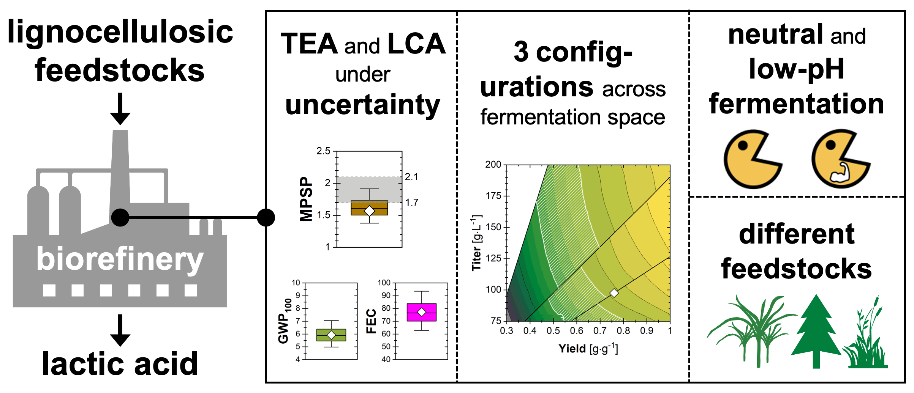

==============================================================
lactic: Production of Lactic Acid from Lignocellulosic Biomass
==============================================================

Simplified process flow scheme
------------------------------

.. figure:: ./images/system_diagram.png

The biorefinery is developed for Li et al. [1]_ for the production of lactic acid
via dilute sulfuric acid pretreatment, fermentation, and separation processes
from lignocellulosic biomass. Part of the script is adopted from [2]_.

Getting Started
---------------

Load the biorefineries by importing, the biorefinery system will be automatically
simulated (first time accessing takes a bit to load the chemicals and system).

.. code-block:: python

    >>> from biorefineries.lactic import system
    
    ---------- Simulation Results ----------
    MPSP is $1.570/kg
    GWP is 5.922 kg CO2-eq/kg lactic acid
    FEC is 77.19 MJ/kg lactic acid
    --------------------
    >>> system.chems
    >>> # All chemicals used in the bioreinfery
    CompiledChemicals([H2O, O2, N2, CH4, CO, CO2, NH3, NO, NO2, H2S, SO2, H2SO4, HNO3, NaOH, NH4OH, CalciumDihydroxide, AmmoniumSulfate, NaNO3, Na2SO4, CaSO4, Ethanol, AceticAcid, Glucose, GlucoseOligomer, Extractives, Xylose, XyloseOligomer, Sucrose, Cellobiose, Mannose, MannoseOligomer, Galactose, GalactoseOligomer, Arabinose, ArabinoseOligomer, SolubleLignin, Protein, Enzyme, FermMicrobe, WWTsludge, Furfural, HMF, Xylitol, LacticAcid, SuccinicAcid, EthylAcetate, EthylLactate, EthylSuccinate, Acetate, AmmoniumAcetate, CalciumLactate, CalciumAcetate, CalciumSuccinate, Glucan, Mannan, Galactan, Xylan, Arabinan, Lignin, P4O10, Ash, Tar, CSL, BoilerChems, Polymer, BaghouseBag, CoolingTowerChems])
    
    
Systems
-------
The system, TEA, and flowsheet are lactic_sys, lactic_tea, and lactic.

Naming conventions:
    D = Distillation column

    E = Evaporator
    
    F = Flash tank

    H = Heat exchange

    M = Mixer

    P = Pump (including conveying belt)

    R = Reactor

    S = Splitter (including solid/liquid separator)

    T = Tank or bin for storage

    U = Other units

    PS = Process specificiation, not physical units, but for adjusting streams

Processes:
    100: Preprocessing

    200: Pretreatment

    300: Conversion

    400: Separation

    500: Wastewater

    600: Facilities

.. code-block:: python

    >>> system.lactic_sys.show() # The complete biorefinery
    System: lactic_sys
     path: (U101, pretreatment_sys,
            conversion_sys, separation_sys,
            wastewater_sys, T601, T601_P,
            T602_S, T602, T603_S, T603, T604,
            T605, T606, T606_P, T607, M601)
     facilities: (HXN, CHP, CT, PWC, ADP, CIP)
    >>> system.lactic_tea.show() # The TEA object
    CombinedTEA: lactic_sys, CHP_sys
     NPV: -945 USD at 10.0% IRR
    >>> system.lactic_sys.flowsheet # The flowsheet
    <Flowsheet: lactic>
    >>> system.R301.show()
    >>> # Any unit operations and streams can be accessed through the module
    SaccharificationAndCoFermentation: R301
    ins...
    [0] s11  from  EnzymeHydrolysateMixer-M301
        phase: 'l', T: 346.78 K, P: 101325 Pa
        flow (kmol/hr): H2O                1.96e+04
                        NH4OH              3.76
                        AmmoniumSulfate    18.8
                        AceticAcid         20.8
                        Glucose            19.7
                        GlucoseOligomer    0.541
                        Extractives        62.2
                        ...
    [1] s12  from  SeedHoldTank-T301
        phase: 'l', T: 323.15 K, P: 101325 Pa
        flow (kmol/hr): H2O                1.46e+03
                        NH4OH              0.283
                        AmmoniumSulfate    1.41
                        AceticAcid         5.49
                        Glucose            2.01
                        GlucoseOligomer    0.528
                        Extractives        4.69
                        ...
    [2] CSL_R301  from  CSLstorage-T604
        phase: 'l', T: 298.15 K, P: 101325 Pa
        flow (kmol/hr): CSL  98
    [3] lime_R301  from  LimeStorage-T605
        phase: 'l', T: 298.15 K, P: 101325 Pa
        flow (kmol/hr): CalciumDihydroxide  259
    outs...
    [0] fermentation_effluent  to  ProcessSpecification-PS301
        phase: 'l', T: 318.25 K, P: 101325 Pa
        flow (kmol/hr): H2O                 1.99e+04
                        NH4OH               3.76
                        CalciumDihydroxide  23.5
                        AmmoniumSulfate     18.8
                        Glucose             23.4
                        GlucoseOligomer     7.01
                        Extractives         62.2
                        ...
    [1] sidedraw  to  SeedTrain-R302
        phase: 'l', T: 323.15 K, P: 101325 Pa
        flow (kmol/hr): H2O                1.46e+03
                        NH4OH              0.283
                        AmmoniumSulfate    1.41
                        AceticAcid         1.84
                        Glucose            11.7
                        GlucoseOligomer    0.528
                        Extractives        4.69
                        ...

Analyses
--------
Multiple analysis modules (in ./analyses) were used to evaluate the biorefinery
from different aspects for [1]_, including: full Monte Carlo simulation,
titer-yield-productivity analysis for the fermentation process, evaluate feedstocks
of varying carbohydrate contents and at different prices, and evaluate feedstocks
of varying succinic acid content.

The system contains three different conversion scenarios, the first scenario
(including baseline) is included in the system.py, and the second and third
systems are included in the system_concentrated.py.

Note that results used in the manuscript [1]_ were generated using biosteam v2.20.21,
thermosteam v0.20.26, and dependencies (`commit f56692d <https://github.com/BioSTEAMDevelopmentGroup/Bioindustrial-Park/commit/f56692d3bc06527b57dc77ed7cb929a40b59bc4d>`_).

To reproduce the results, directly run the script of interest, and results will
be saved as Excel files in the same directory path as the module.

References
----------
.. [1] Li et al., Sustainable Lactic Acid Production from Lignocellulosic Biomass.
     ACS Sustainable Chem. Eng. 2021.
     `<https://doi.org/10.1021/acssuschemeng.0c08055>`_    
.. [2] Cortes-Peña et al., BioSTEAM: A Fast and Flexible Platform for the Design,
    Simulation, and Techno-Economic Analysis of Biorefineries under Uncertainty. 
    ACS Sustainable Chem. Eng. 2020, 8 (8), 3302–3310. 
    `<https://doi.org/10.1021/acssuschemeng.9b07040>`_

