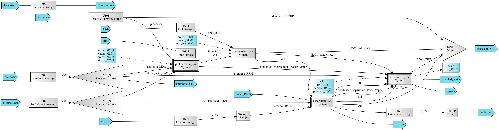

==============================================================
lactic: Production of Lactic Acid from Lignocellulosic Biomass
==============================================================

Simplified process flow scheme
------------------------------

The biorefinery is developed for Li et al. [1]_ for the production of lactic acid
via dilute sulfuric acid pretreatment, fermentation, and separation processes
from lignocellulosic biomass. Part of the script is adopted from [2]_.

Getting Started
---------------
Two configurations are now included in this biorefinery, one with simultaneous
saccahrification and co-fermentation (SSCF), one with separate hydrolysis and
co-fermentation (SHF). You can choose which system to load.

.. code-block:: python

    >>> from biorefineries import lactic as la
    >>> la.load_system('SSCF')
    >>> # Once loaded, you can have a quick glance of the results
    >>> # Note that the first simulation will take a longer time
    >>> la.simulate_and_print()
    
    ---------- Simulation Results ----------
    MPSP is $1.385/kg
    GWP is 4.522 kg CO2-eq/kg lactic acid
    FEC is 58.32 MJ/kg lactic acid
    ------------------------------------------
    >>> la.chems.show()
    >>> # All chemicals used in the bioreinfery
    CompiledChemicals([H2O, O2, N2, CH4, CO, CO2, NH3, NO, NO2, H2S, SO2, H2SO4, HNO3, NaOH, NH4OH, CalciumDihydroxide, AmmoniumSulfate, NaNO3, Na2SO4, CaSO4, Ethanol, AceticAcid, Glucose, GlucoseOligomer, Extractives, Xylose, XyloseOligomer, Sucrose, Cellobiose, Mannose, MannoseOligomer, Galactose, GalactoseOligomer, Arabinose, ArabinoseOligomer, SolubleLignin, Protein, Enzyme, FermMicrobe, WWTsludge, Furfural, HMF, Xylitol, LacticAcid, SuccinicAcid, EthylAcetate, EthylLactate, EthylSuccinate, Acetate, AmmoniumAcetate, CalciumLactate, CalciumAcetate, CalciumSuccinate, Glucan, Mannan, Galactan, Xylan, Arabinan, Lignin, P4O10, Ash, Tar, CSL, BoilerChems, Polymer, BaghouseBag, CoolingTowerChems])
    >>> # To load the alternative configuration, you can just use the load_system function
    >>> la.load_system('SHF')
    >>> la.simulate_and_print()
    
    ---------- Simulation Results ----------
    MPSP is $1.424/kg
    GWP is 4.459 kg CO2-eq/kg lactic acid
    FEC is 57.40 MJ/kg lactic acid
    ------------------------------------------
    

Systems
-------
The `Flowsheet`, `System`, and `TEA`, objects are `flowsheet`, `lactic_sys`, and `lactic_tea`, respectively.

Naming conventions:
    D = Distillation column

    E = Evaporator
    
    F = Flash tank

    H = Heat exchange

    M = Mixer

    P = Pump (including conveying belt)

    R = Reactor

    S = Splitter (including solid/liquid separator)

    T = Tank or bin for storage

    U = Other units

    PS = Process specificiation, not physical units, but for adjusting streams

Processes:
    100: Preprocessing

    200: Pretreatment

    300: Conversion

    400: Separation

    500: Wastewater

    600: Facilities

.. code-block:: python

    >>> # You can directly access the Flowsheet, System, and TEA objects
    >>> la.load_system('SSCF')
    >>> la.simulate_and_print()
    >>> la.flowsheet
    <Flowsheet: SSCF>
    >>> la.lactic_sys.show()
    System: lactic_sys
    ins...
    [0] feedstock
        phase: 'l', T: 298.15 K, P: 101325 Pa
        flow (kmol/hr): H2O          1.16e+03
                        Extractives  62.2
                        Sucrose      1.87
                        Protein      113
                        Acetate      25.1
                        Glucan       180
                        Mannan       3.08
                        ...
    [1] water_M201
        phase: 'l', T: 387.15 K, P: 101325 Pa
        flow (kmol/hr): H2O  2.05e+03
    [2] water_M202
        phase: 'l', T: 368.15 K, P: 101325 Pa
        flow (kmol/hr): H2O  7.83e+03
    [3] steam_M203
        phase: 'g', T: 506.15 K, P: 1.041e+06 Pa
        flow (kmol/hr): H2O  1.75e+03
    [4] water_M205
        phase: 'l', T: 298.15 K, P: 101325 Pa
        flow (kmol/hr): H2O  723
    [5] enzyme_M301
        phase: 'l', T: 298.15 K, P: 101325 Pa
        flow (kmol/hr): Enzyme  24
    [6] water_M301
        phase: 'l', T: 298.15 K, P: 101325 Pa
        flow (kmol/hr): H2O  7.69e+03
    [7] water_R301
        phase: 'l', T: 298.15 K, P: 101325 Pa
        flow: 0
    [8] water_R403
        phase: 'l', T: 298.15 K, P: 101325 Pa
        flow: 0
    [9] s42
        phase: 'l', T: 298.15 K, P: 101325 Pa
        flow: 0
    [10] caustic_R502
        phase: 'l', T: 298.15 K, P: 101325 Pa
        flow (kmol/hr): NaOH  56.3
    [11] polymer_R502
        phase: 'l', T: 298.15 K, P: 101325 Pa
        flow (kmol/hr): Polymer  2.15
    [12] air_R502
        phase: 'g', T: 298.15 K, P: 101325 Pa
        flow (kmol/hr): O2  1.84e+03
                        N2  6.93e+03
    [13] sulfuric_acid
        phase: 'l', T: 298.15 K, P: 101325 Pa
        flow (kmol/hr): H2O    111
                        H2SO4  270
    [14] ammonia
        phase: 'l', T: 298.15 K, P: 101325 Pa
        flow (kmol/hr): NH4OH  103
    [15] CSL
        phase: 'l', T: 298.15 K, P: 101325 Pa
        flow (kmol/hr): CSL  104
    [16] lime
        phase: 'l', T: 298.15 K, P: 101325 Pa
        flow (kmol/hr): CalciumDihydroxide  259
    [17] ethanol
        phase: 'l', T: 298.15 K, P: 101325 Pa
        flow (kmol/hr): Ethanol  10.8
    [18] firewater_in
        phase: 'l', T: 298.15 K, P: 101325 Pa
        flow (kmol/hr): H2O  445
    [19] plant_air_in
        phase: 'g', T: 298.15 K, P: 101325 Pa
        flow (kmol/hr): O2  9.01e+03
                        N2  3.87e+04
    [20] lime_CHP
        phase: 'l', T: 298.15 K, P: 101325 Pa
        flow (kmol/hr): CalciumDihydroxide  0.655
    [21] boiler_chems
        phase: 'l', T: 298.15 K, P: 101325 Pa
        flow (kmol/hr): BoilerChems  0.0045
    [22] baghouse_bag
        phase: 'l', T: 298.15 K, P: 101325 Pa
        flow (kmol/hr): BaghouseBag  2.41
    [23] natural_gas
        phase: 'l', T: 298.15 K, P: 101325 Pa
        flow (kmol/hr): CH4  1.38e+03
    [24] boiler_makeup_water
        phase: 'l', T: 298.15 K, P: 101325 Pa
        flow (kmol/hr): H2O  1.19e+03
    [25] CIP_chems_in
        phase: 'l', T: 298.15 K, P: 101325 Pa
        flow (kmol/hr): H2O  8.05
    [26] return_cooling_water
        phase: 'l', T: 310.15 K, P: 101325 Pa
        flow (kmol/hr): H2O  1.9e+06
    [27] cooling_tower_chems
        phase: 'l', T: 298.15 K, P: 101325 Pa
        flow (kmol/hr): CoolingTowerChems  6.31
    [28] CT_makeup_water
        phase: 'l', T: 298.15 K, P: 101325 Pa
        flow (kmol/hr): H2O  2.94e+03
    [29] system_makeup_water
        phase: 'l', T: 298.15 K, P: 101325 Pa
        flow (kmol/hr): H2O  5.04e+03
    outs...
    [0] gypsum
        phase: 'l', T: 351.65 K, P: 101325 Pa
        flow (kmol/hr): H2O                510
                        H2SO4              11.4
                        AmmoniumSulfate    0.739
                        CaSO4              226
                        AceticAcid         36.2
                        Glucose            0.821
                        GlucoseOligomer    0.251
                        ...
    [1] vent_R502
        phase: 'g', T: 308.04 K, P: 101325 Pa
        flow (kmol/hr): H2O  228
                        O2   1.78e+03
                        N2   6.93e+03
                        CO2  66.5
    [2] brine
        phase: 'l', T: 308.04 K, P: 101325 Pa
        flow (kmol/hr): H2O                252
                        NaOH               55.1
                        CaSO4              7.7e-09
                        AceticAcid         0.074
                        Glucose            3.13e-08
                        GlucoseOligomer    0.00266
                        Extractives        0.024
                        ...
    [3] lactic_acid
        phase: 'l', T: 345 K, P: 101325 Pa
        flow (kmol/hr): H2O           116
                        Ethanol       0.672
                        AceticAcid    0.249
                        Furfural      0.204
                        HMF           0.00744
                        LacticAcid    272
                        EthylLactate  10
    [4] firewater_out
        phase: 'l', T: 298.15 K, P: 101325 Pa
        flow (kmol/hr): H2O  445
    [5] plant_air_out
        phase: 'g', T: 298.15 K, P: 101325 Pa
        flow (kmol/hr): O2  9.01e+03
                        N2  3.87e+04
    [6] vent_CHP
        phase: 'g', T: 539.15 K, P: 101325 Pa
        flow (kmol/hr): H2O  4.2e+03
                        N2   45.6
                        CO2  3.19e+03
                        NH3  63.2
                        SO2  2
    [7] ash
        phase: 's', T: 539.15 K, P: 101325 Pa
        flow (kmol/hr): NaOH                1.22
                        CalciumDihydroxide  0.109
                        AmmoniumSulfate     0.0558
                        CaSO4               24.4
                        CalciumLactate      7.35
                        CalciumAcetate      1.4
                        Ash                 71.8
                        ...
    [8] boiler_blowdown
        phase: 'l', T: 373.15 K, P: 101325 Pa
        flow (kmol/hr): H2O  1.19e+03
    [9] CIP_chems_out
        phase: 'l', T: 298.15 K, P: 101325 Pa
        flow (kmol/hr): H2O  8.05
    [10] process_cooling_water
        phase: 'l', T: 301.15 K, P: 101325 Pa
        flow (kmol/hr): H2O  1.9e+06
    [11] cooling_tower_blowdown
        phase: 'l', T: 301.15 K, P: 101325 Pa
        flow (kmol/hr): H2O  2.94e+03
    [12] process_water
        phase: 'l', T: 298.15 K, P: 101325 Pa
        flow (kmol/hr): H2O  2.42e+04
    [13] discharged_water
        phase: 'l', T: 298.15 K, P: 101325 Pa
        flow: 0
    >>> la.lactic_tea.show()
    LacticTEA: lactic_sys
     NPV: -835 USD at 10.0% IRR
    >>> # You can use the flowsheet to access streams, unit operations, and subsystems
    >>> u = la.flowsheet.unit
    >>> u.R301.show()
    SaccharificationAndCoFermentation: R301
    ins...
    [0] s12  from  HXutility-H301
        phase: 'l', T: 323.15 K, P: 101325 Pa
        flow (kmol/hr): H2O                1.96e+04
                        NH4OH              3.76
                        AmmoniumSulfate    18.8
                        AceticAcid         20.6
                        Glucose            19.7
                        GlucoseOligomer    0.541
                        Extractives        62.2
                        ...
    [1] s13  from  SeedHoldTank-T301
        phase: 'l', T: 323.15 K, P: 101325 Pa
        flow (kmol/hr): H2O                1.46e+03
                        NH4OH              0.283
                        AmmoniumSulfate    1.41
                        AceticAcid         5.47
                        Glucose            2.01
                        GlucoseOligomer    0.528
                        Extractives        4.69
                        ...
    [2] CSL_R301  from  CSLstorage-T604
        phase: 'l', T: 298.15 K, P: 101325 Pa
        flow (kmol/hr): CSL  104
    [3] lime_R301  from  LimeStorage-T605
        phase: 'l', T: 298.15 K, P: 101325 Pa
        flow (kmol/hr): CalciumDihydroxide  259
    [4] water_R301
        phase: 'l', T: 298.15 K, P: 101325 Pa
        flow: 0
    outs...
    [0] fermentation_effluent  to  ProcessSpecification-PS301
        phase: 'l', T: 318.24 K, P: 101325 Pa
        flow (kmol/hr): H2O                 1.99e+04
                        NH4OH               3.76
                        CalciumDihydroxide  23.5
                        AmmoniumSulfate     18.8
                        Glucose             23.4
                        GlucoseOligomer     7.01
                        Extractives         62.2
                        ...
    [1] sidedraw  to  SeedTrain-R302
        phase: 'l', T: 323.15 K, P: 101325 Pa
        flow (kmol/hr): H2O                1.46e+03
                        NH4OH              0.283
                        AmmoniumSulfate    1.41
                        AceticAcid         1.82
                        Glucose            11.7
                        GlucoseOligomer    0.528
                        Extractives        4.69
                        ...

Analyses
--------
Multiple analysis modules (in ./analyses) were used to evaluate the biorefinery
from different aspects for [1]_, including: full Monte Carlo simulation,
titer-yield-productivity analysis for the fermentation performance space,
and evaluate feedstocks of varying carbohydrate contents and prices.

Note that results used in the manuscript [1]_ were generated using biosteam v2.20.21,
thermosteam v0.20.26, and dependencies (`commit f56692d <https://github.com/BioSTEAMDevelopmentGroup/Bioindustrial-Park/commit/f56692d3bc06527b57dc77ed7cb929a40b59bc4d>`_).

To reproduce the results, directly run the script of interest, and results will
be saved as Excel files in the same directory path as the module.

References
----------
.. [1] Li et al., Sustainable Lactic Acid Production from Lignocellulosic Biomass.
    ACS Sustainable Chem. Eng. 2021, 9 (3), 1341–1351.
     `<https://doi.org/10.1021/acssuschemeng.0c08055>`_
     
.. [2] Cortes-Peña et al., BioSTEAM: A Fast and Flexible Platform for the Design,
    Simulation, and Techno-Economic Analysis of Biorefineries under Uncertainty. 
    ACS Sustainable Chem. Eng. 2020, 8 (8), 3302–3310. 
    `<https://doi.org/10.1021/acssuschemeng.9b07040>`_

