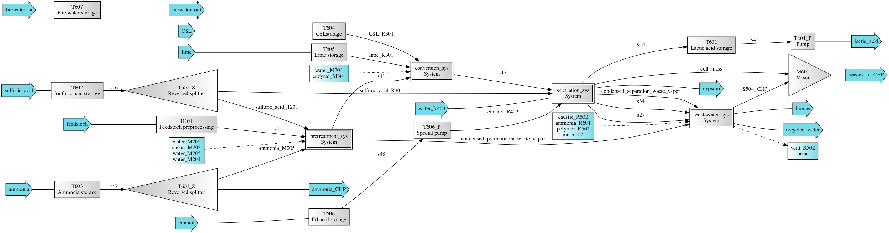

======================================================================
lactic: Production of Lactic Acid from Lignocellulosic Feedstocks
======================================================================

Simplified process flow scheme
------------------------------

The biorefinery is developed for a manuscript in preparation [1] for the production
of lactic acid  via dilute sulfuric acid pretreatment, fermentation, and separation
processes from lignocellulosic biomass. Part of the script is based on [2] and [3].

Getting Started
---------------

Load the biorefineries by importing, the biorefinery system will be automatically
simulated (first time accessing takes a bit to load the chemicals and system).

.. code-block:: python

    >>> from biorefineries.lactic import system
    >>> system.simulate_and_print()
    ---------- Baseline biorefinery ----------
    MPSP is $1.470/kg
    GWP is 4.630 kg CO2-eq/kg lactic acid
    Freshwater consumption is 4.124 kg H2O/kg lactic acid
    --------------------
    >>> system.chems    
    >>> # All chemicals used in acid and base biorefineries, can also use base.chems
    CompiledChemicals([H2O, O2, N2, CH4, CO, CO2, NH3, NO, NO2, H2S, SO2, H2SO4, HNO3, NaOH, NH4OH, CalciumDihydroxide, AmmoniumSulfate, NaNO3, Na2SO4, CaSO4, Ethanol, AceticAcid, Glucose, GlucoseOligomer, Extractives, Xylose, XyloseOligomer, Sucrose, Cellobiose, Mannose, MannoseOligomer, Galactose, GalactoseOligomer, Arabinose, ArabinoseOligomer, SolubleLignin, Protein, Enzyme, FermMicrobe, WWTsludge, Furfural, HMF, Xylitol, LacticAcid, SuccinicAcid, EthylAcetate, EthylLactate, EthylSuccinate, Acetate, AmmoniumAcetate, CalciumLactate, CalciumAcetate, CalciumSuccinate, Glucan, Mannan, Galactan, Xylan, Arabinan, Lignin, P4O10, Ash, Tar, CSL, BoilerChems, Polymer, BaghouseBag, CoolingTowerChems])
    
    
Systems
-------
The system, TEA, and flowsheet are lactic_sys, lactic_tea, and lactic.

Naming conventions:
    D = Distillation column
    
    F = Flash tank

    H = Heat exchange

    M = Mixer

    P = Pump (including conveying belt)

    R = Reactor

    S = Splitter (including solid/liquid separator)

    T = Tank or bin for storage

    U = Other units

    PS = Process specificiation, not physical units, but for adjusting streams

Processes:
    100: Feedstock preprocessing

    200: Pretreatment

    300: Conversion

    400: Separation

    500: Wastewater treatment

    600: Facilities

.. code-block:: python

    >>> system.lactic_sys.show() # The complete biorefinery
    System: lactic_sys
     path: (U101, pretreatment_sys,
            conversion_sys, separation_sys,
            wastewater_sys, T601, T601_P,
            T602_S, T602, T603_S, T603, T604,
            T605, T606, T606_P, T607, M601)
     facilities: (HXN, CHP, CT, PWC, ADP, CIP)
    >>> acid.ethanol_tea.show() # The TEA object
    CombinedTEA: lactic_sys, CHP_sys
     NPV: -966 USD at 10.0% IRR
     ROI: -0.00435 1/yr
     PBP: 9.5 yr
    >>> system.lactic_sys.flowsheet # The flowsheet
    <Flowsheet: lactic>
    >>> system.R301.show()
    >>> # Any unit operations and streams can be accessed through the module
    SaccharificationAndCoFermentation: R301
    ins...
    [0] s13  from  EnzymeHydrolysateMixer-M301
        phase: 'l', T: 314.01 K, P: 101325 Pa
        flow (kmol/hr): H2O                1.96e+04
                        NH4OH              3.76
                        AmmoniumSulfate    18.8
                        AceticAcid         21.1
                        Glucose            19.7
                        GlucoseOligomer    0.541
                        Extractives        62.2
                        ...
    [1] s14  from  SeedHoldTank-T301
        phase: 'l', T: 323.15 K, P: 101325 Pa
        flow (kmol/hr): H2O                1.46e+03
                        NH4OH              0.283
                        AmmoniumSulfate    1.41
                        AceticAcid         5.51
                        Glucose            2.01
                        GlucoseOligomer    0.528
                        Extractives        4.69
                        ...
    [2] CSL_R301  from  CSLstorage-T604
        phase: 'l', T: 298.15 K, P: 101325 Pa
        flow (kmol/hr): CSL  96.4
    [3] lime_R301  from  LimeStorage-T605
        phase: 'l', T: 298.15 K, P: 101325 Pa
        flow (kmol/hr): CalciumDihydroxide  259
    outs...
    [0] fermentation_effluent  to  ProcessSpecification-PS301
        phase: 'l', T: 314.11 K, P: 101325 Pa
        flow (kmol/hr): H2O                 1.99e+04
                        NH4OH               3.76
                        CalciumDihydroxide  23.6
                        AmmoniumSulfate     18.8
                        Glucose             23.4
                        GlucoseOligomer     7.01
                        Extractives         62.2
                        ...
    [1] sidedraw  to  SeedTrain-R302
        phase: 'l', T: 323.15 K, P: 101325 Pa
        flow (kmol/hr): H2O                1.46e+03
                        NH4OH              0.283
                        AmmoniumSulfate    1.41
                        AceticAcid         1.86
                        Glucose            11.7
                        GlucoseOligomer    0.528
                        Extractives        4.69
                        ...

Analyses
--------
Multiple analysis modules (in ./analyses) were used to evaluate the biorefinery
from different aspects for [1], including: full Monte Carlo simulation,
titer-yield-productivity analysis for the fermentation process, evaluate feedstocks
of varying carbohydrate contents and at different prices, and evaluate feedstocks
of varying succinic acid content.

To reproduce the results, directly run the script of interest, and results will
be saved as Excel files in the same directory path as the module.

References
----------
.. [1] Li et al., Evaluating the Sustainability of Lactic Acid Production from
    Lignocellulosic Biomass. In Preparation 2020.
    
.. [2] Li et al., Tailored Pretreatment Processes for the Sustainable Design of
    Lignocellulosic Biorefineries across the Feedstock Landscape. Submitted 2020.
    
.. [3] Cortes-Peña et al., BioSTEAM: A Fast and Flexible Platform for the Design,
    Simulation, and Techno-Economic Analysis of Biorefineries under Uncertainty. 
    ACS Sustainable Chem. Eng. 2020, 8 (8), 3302–3310. 
    https://doi.org/10.1021/acssuschemeng.9b07040

