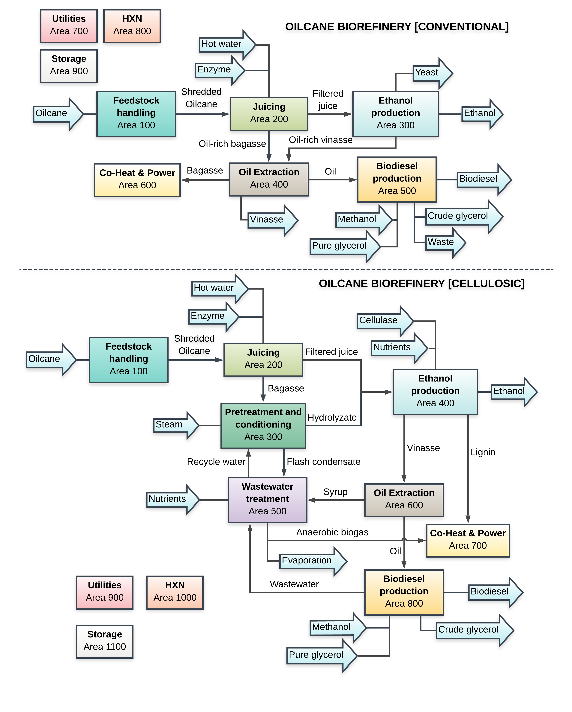
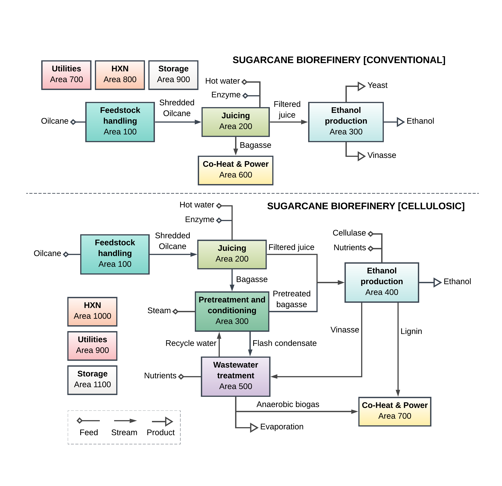

# oilcane: Oilcane Biorefineries and Benchmarks

This module contains oilcane biorefinery configurations and "benchmark" 
sugarcane biorifinery configurations, as discussed in [[1]](#1). Two configurations
are currently available: (I) conventional oil extraction by the expression of 
bagasse and centrifugation of vinasse from juice fermentation, and (II) oil 
extraction after an integrated, single-step co-fermentation of both the juice 
and bagasse hydrolysate. In contrast to the `biorefineries.lipidcane` module,
mass balances around oil separation are based on experimental results and
the oil composition is accounted for. Note that the name "oilcane" is prefered 
over lipid-cane, as it resonates better with non-scientific audience and is more
consistent with how we talk about vegetable oils.



All configurations share the same feedstock handling, juicing, and biodiesel 
production systems. In the juicing system, the oilcane is crushed, the juice 
is treated and filtered to remove impurities, and the bagasse is conveyed out 
at a moisture content of 50%. The bagasse is assumed to retain 40-70% of the 
total oil present in oilcane. In the biodiesel production area, the oil is 
first pretreated to remove polar lipids and convert any free fatty acids 
(FFAs) to acyl glycerides via glycerolysis.14–16 Once pretreated, the oil is 
trans-esterified with excess methanol and sodium methoxide catalyst to produce 
biodiesel and glycerol. The biodiesel is centrifuged out, washed, and vacuum 
dried. The glycerol is distilled to 80 wt % and sold as crude glycerol. 

The conventional oil separation configuration can be divided into nine areas: 
feedstock handling, juicing, ethanol production, oil extraction, 
biodiesel production, combined heat and power, utilities, 
heat exchanger network (HXN), and storage. The oil-rich bagasse is pelleted to 
reduce the moisture content and volume to extract 50 to 70% of the oil by 
screw pressing (Area 400). Then, the bagasse is burned to produce steam and 
electricity for the plant (Area 600), with excess electricity sold to the 
grid. The juice is fermented and distilled (Area 300). The vinasse is also 
sent to the oil extraction area (Area 400), where it is concentrated by 
evaporation then centrifuged to extract the oil. The utility area includes 
on-site recirculation of cooling water and chilled water (Area 700).

The cellulosic oil extraction configuration can be divided into eleven areas: 
feedstock handling, juicing, pretreatment and conditioning, ethanol production, 
wastewater treatment, oil extraction, combined heat and power, biodiesel 
production, utilities, HXN, and storage. In contrast to the conventional 
configuration, no drying or pelleting is necessary as the solids loading 
(i.e., the mass fraction of soluble and insoluble solids) for the pretreatment 
reactor is 50% and the bagasse is assumed to be at 50% moisture content. High 
pressure and temperature liquid hot water is used to pretreat the bagasse and 
facilitate enzymatic hydrolysis (Area 300). Both the hydrolysate and the juice 
are sent to Area 400, where it is saccharified at a solids loading of 23 wt. %, 
filter-pressed to remove lignin, and fermented. The vinasse is concentrated by 
evaporation and centrifuged to extract 99% of the oil (Area 600). The syrup is 
sent to wastewater treatment to produce biogas (Area 500). Both the biogas and 
lignin are sent to burn at the combined-heat and power system (Area 700) to 
produce steam and electricity. 

Two sugarcane biorefinery configurations are also included in this module
as benchmarks to compare the economic benefit of processing oil-producing 
feedstocks over their non-oil counterparts. The conventional and cellulosic 
ethanol sugarcane biorefineries are non-oil processing counterparts to the 
conventional and cellulosic configurations of the oilcane biorefineries, 
respectively, and follow the same assumptions and overall configurations with 
the exception of no oil extraction or biodiesel production areas.



Integrated oilsorghum processing is also implemented in this module using
BioSTEAM's agile system simulation features. Because oilsorghum can be 
harvested for 2 months when oilcane is not in season, an idle oilcane 
biorefinery could potentially increase biofuel production by processing 
oilsorghum.

Getting Started
---------------

Four biorefineries can be loaded using the names detailed in the following table.

|           |                         | Conventional | Cellulosic |
| --------- | ----------------------- | ------------ | ---------- |
| Oilcane   | Single feedstock        | O1           | O2         |
|           | With sorghum processing | O1\*         | O2\*       |
| Sugarcane | Single feedstock        | S1           | S2         |
|           | With sorghum processing | S1\*         | S2\*       |

Here are a few examples:

```python

>>> import biorefineries.oilcane as oc
>>> oc.load('S1') # Load conventional sugarcane system
>>> oc.sys.show(data=False) # Full system
System: sugarcane_sys
ins...
[0] sugarcane
[1] enzyme
[2] H3PO4
[3] lime
[4] polymer
[5] denaturant
outs...
[0] ethanol
[1] vinasse
[2] wastewater
[3] emissions
[4] ash_disposal

>>> oc.tea.solve_price(oc.sugarcane) # Solve MFPP in USD/kg
0.02848

>>> oc.load('O1') # Load conventional oilcane system
>>> oc.sys.show(data=False)
System: oilcane_sys
ins...
[0] oilcane
outs...
[0] ethanol
[1] biodiesel
[2] crude_glycerol
[3] vinasse

>>> oc.tea.solve_price(oc.oilcane) # Solve MFPP in USD/kg
0.02966

```

## References
<a id="1">[1]</a> 
    Cortes-Pena, YR.; Kurambhatti CV.; Eilts K.; Singh, V.; Guest, JS. 
    Techno-Economic Implications of Integrating Cellulosic Ethanol Production 
    and Seasonal Oilsorghum Processing at an Oilcane Biorefinery Co-Producing 
    Ethanol and Biodiesel. In Preparation.

