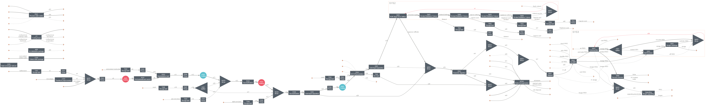

# Microalgae to MCCA without external electron donor

This repository contains the simulation models and analysis for the research project: [**"Conversion of waste microalgae into caproic acid using anaerobic membrane bioreactors without external electron donors"**](https://doi.org/10.1039/D6GC00346J).

The models are built using [BioSTEAM](https://github.com/BioSTEAMDevelopmentGroup/BioSTEAM), a platform for the design, simulation, and techno-economic analysis (TEA) of biorefineries.

## Overview

The project explores the production of medium-chain carboxylic acids (MCCAs), specifically caproic acid, from waste microalgae via anaerobic fermentation. A key feature of this process is the absence of external electron donor addition. This system present an anaerobic membrane bioreactor platform with integrating yeast to generate electron donors *in situ*.


## Repository Structure

[system.py](system.py): Main system for MCCA prodcution with yeast addition. The outcome of TEA can be found by running ```system.py```

[system_ethanol.py](system_ethanol.py): Scenario with ethanol as an electron donor.

[system_noCyeast.py](system_noCyeast.py): Scenario with yeast continuous addition

[system_no_yeast.py](system_no_yeast.py): Scenarios without yeast addition.

[lca.py](lca.py): Module for performing Life Cycle Assessment. 

[streams.py](streams.py): Definition of feedstock streams.

[utils.py](utils.py): Utility functions for cost and LCA calculations.

[_chemicals.py](_chemicals.py): Chemical usage and their thermodynamic property definitions for the chemical species involved.

```parameter_distributions_*.xlsx```: Parameter distributions for uncertainty analysis.

## Getting start
To run the simulations, you can use the provided system files as entry points. For example:
```bash 
python system.py
```

To get LCA outcome, plese run the ```lca.py```
```bash 
python lca.py
```

## Citation

If this repository is helpful to your research, please cite the following publication:

> Shi X; Wei W; Zhao J; Li Y; Liu X, Xu J, Ni BJ, 2026, **Conversion of waste microalgae into caproic acid using anaerobic membrane bioreactors without external electron donors**, *Green Chemistry* ([https://doi.org/10.1039/D6GC00346J](https://doi.org/10.1039/D6GC00346J))


