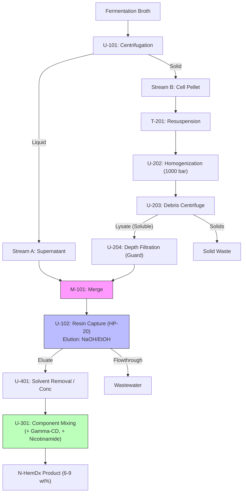

# N-HemDx Process Basis of Design (BOD) & Implementation Plan

## 1. Process Description

The N-HemDx process is designed to recover recombinant Heme b from *Corynebacterium glutamicum*, utilizing a "Split-Stream" approach to capture both intracellular and extracellular product. The purified heme is subsequently formulated with **$\gamma$-Cyclodextrin ($\gamma$-CD)** and **Nicotinamide (Nic)** to form the stable, soluble product **N-HemDx**.

### 1.1 Upstream (Reference)
*   **Host**: *Corynebacterium glutamicum*.
*   **Streams**:
    *   **Stream A (Supernatant)**: Contains extracellular Heme b (approx. 50% of total), salts, and glucose.
    *   **Stream B (Biomass Pellet)**: Contains intracellular Heme b (approx. 50% of total), cell debris, and host cell proteins (HCP).

### 1.2 Downstream Recovery (Split-Stream Topology)

**Path A: Supernatant Processing**
1.  **Clarification**: The fermentation broth is centrifuged (U-101) to separate Stream A (Supernatant) from Stream B (Wet Cell Pellet).
2.  **Conditioning**: Stream A is pH-adjusted if necessary to ensure Heme solubility/binding (typically Acidic/Neutral for hydrophobic adsorption).

**Path B: Intracellular Processing**
1.  **Resuspension**: The Wet Cell Pellet is resuspended in extraction buffer (T-201).
2.  **Cell Lysis (U-202)**: **High-Pressure Homogenization (HPH)** at **800–1200 bar (12–17 kpsi)** for 2–3 passes. Temperature controlled < 10°C to prevent degradation. (Ref: *Ko et al., 2021*).
3.  **Debris Removal (U-203)**: The lysate is Centrifuged (Disk Stack or Decanter) to remove cell wall debris and insolubilies.
4.  **Guard Filtration (U-204)**: The Clarified Lysate undergoes **Depth Filtration** (0.2–0.45 $\mu$m nominal) to protect the subsequent resin column from lipid/protein fouling. *Decision Point: This step is critical before merging with Stream A.*

**Path C: Combined Capture & Purification**
1.  **Stream Merging**: Conditioned Stream A and Filtered Stream B are merged (M-101).
2.  **Capture (U-102)**: The combined stream is loaded onto a **Hydrophobic Adsorbent Resin** (e.g., HP-20 or SP-850).
    *   *Wash*: Water/Buffer to remove salts and glucose.
    *   *Elution*: **NaOH (0.1 M) + Ethanol (20-50% v/v)** gradient. Heme elutes at high pH/organic solvent. (Ref: *Asenjo*).
3.  **Concentration/Solvent Removal (U-401)**: The eluate is processed via **Tangential Flow Filtration (TFF)** or Evaporation to remove Ethanol and concentrate Heme.

### 1.3 Formulation (N-HemDx Synthesis)

1.  **Reaction (U-301)**: Purified Heme concentrate is mixed with:
    *   **$\gamma$-Cyclodextrin**: 1:1 Molar Ratio with Heme (Ref: *Li et al., 2025*; $\gamma$-CD selected for cavity size ~8.3Å vs Heme ~10Å).
    *   **Nicotinamide**: **20:1 Molar Excess** relative to Heme to maintain "bright red" hemochrome state and prevent oxidation (Ref: *Zhou et al., 2014* inferred logic).
2.  **Equilibration**: Stirred Batch Reactor (CSTR mode for simulation) at moderate temperature (25-30°C) for 1-2 hours.
3.  **Final Polish (U-402)**: Ultrafiltration (TFF) if needed to remove excess salts/unbound Nicotinamide, though excess Nic serves as stabilizer. Target product concentration: **6–9 wt%**.

---

## 2. Block Flow Diagram (BFD)

---

## 3. Mass Balance & Logic Settings

### 3.1 Stoichiometry & Yields
*   **Lysis Efficiency**: 95% release of intracellular heme at 1000 bar, 3 passes.
*   **Resin Capture Efficiency**: 90% (conservative estimate for mixed stream).
*   **Reaction Stoichiometry**:
    *   Heme + $\gamma$-CD $\rightarrow$ Heme-CD (1:13.45340232 mol)
    *   Heme-CD + Nicotinamide $\rightarrow$ N-HemDx (Coordination)
    *   **Feeds**: Add $\gamma$-CD at 1.05 equivalent (slight excess). Add Nicotinamide at 20.0 equivalent.
*   **Solubility**: N-HemDx design target is 90 g/L (9 wt%).

### 3.2 Key Streams Definitions (Simulation)
*   `Stream_A`: Glucose, Water, Heme_b (soluble), Salts.
*   `Stream_B`: Biomass (Cell_Cellulose, Cell_Protein), Lipid, Heme_b (internal).
*   `Elution_Solvent`: Water + NaOH (0.1M) + Ethanol (30%).

---

## 4. Equipment specifications

| ID        | Name             | Type                  | Key Parameter                     | MOC           | Notes                                            |
| :-------- | :--------------- | :-------------------- | :-------------------------------- | :------------ | :----------------------------------------------- |
| **U-101** | Broth Splitter   | Centrifuge (Disk)     | G-force: 10,000 g                 | 316L SS       | Split efficiency 98% solids capture              |
| **U-202** | Cell Disruptor   | Homogenizer           | Pressure: 1000 bar (14.5 kpsi)    | 316L SS       | Cooling jacket required (<10°C)                  |
| **U-203** | Debris Removal   | Centrifuge (Decanter) | Solids discharge capacity         | 316L SS       | Handles high solids load from lysis              |
| **U-204** | Guard Filter     | Depth Filter          | Area: Flux dependent              | Polypropylene | Disposable modules favored to prevent fouling    |
| **U-102** | Capture Column   | Chromatography        | Bed Volume (Dynamic Binding Cap.) | Acrylic/Glass | Resin: HP-20 or equivalent. Cycle time critical. |
| **U-401** | Solvent Strip    | TFF / Distillation    | MWCO: < 500 Da (Retain Heme)      | 316L SS       | If TFF: 1 kDa module. Heme MW ~616 Da.           |
| **U-301** | Formulation Tank | Reactor (CSTR)        | Mixing Rate, Temp Control         | 316L SS       | Gentle mixing. Low shear.                        |

### 4.1 TFF Specification (U-401 Check)
*   **Heme MW**: ~616 Da.
*   **Heme-CD Complex MW**: ~616 + 1297 ($\gamma$-CD) $\approx$ 1913 Da.
*   **Separation Goal**: Remove Water/Ethanol/Salts.
*   **Membrane**: 1 kDa MWCO would retain Heme-CD but might pass free Heme.
    *   *Correction*: Concentration is done on the **Eluate** (Free Heme ~616 Da) BEFORE Complexation to save CD volume.
    *   Therefore, **Nanofiltration (NF)** or **Evaporation** is preferred over UF for the Elution stream. If TFF is used, MWCO must be **< 300-500 Da** (Tight NF) to retain free Heme.

---

## 5. Next Steps (Implementation)
1.  **Define Chemicals**: Update `chemicals` to include $\gamma$-Cyclodextrin (`Suzuki-Miyaura` or define from PubChem) and Nicotinamide.
2.  **Build Unit Classes**:
    *   Create `HPH` unit (inheriting `bst.Unit`) with pressure-dependent power correlations.
    *   Create `ResinCapture` unit with cycle logic (Load/Wash/Elute).
3.  **Construct Flowsheet**: Assemble using the `SystemFactory` pattern.

