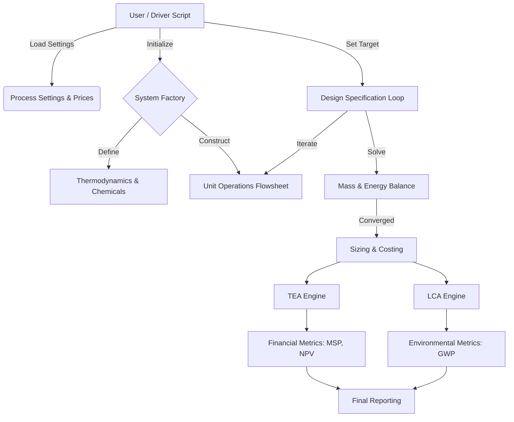

Here is the **Living Documentation Suite** for the **PREFERS v1** codebase. This documentation is structured to serve Product Managers, System Architects, Data Integrators, and Developers.

---

# PREFERS v1: Living Documentation Suite

**Version:** 1.0 (LegH Production / HemeIn Dev)  
**Framework:** Python 3.12 (BioSTEAM, Thermosteam, ChaosPy)  
**Context:** Bioindustrial Park / Precision Fermentation

---

## SECTION 1: SYSTEM OVERVIEW (The "Product Manager" View)

### Project Description
**PREFERS (Precision Fermentation Simulation)** is a modular, high-fidelity techno-economic and environmental assessment (TEA/LCA) framework. It simulates the industrial production of high-value heme proteins (specifically **Leghemoglobin** and **Hemodextrin**) via precision fermentation.

Unlike static spreadsheet models, PREFERS utilizes **BioSTEAM** to perform rigorous mass and energy balances, dimension equipment based on first principles, and dynamically calculate Minimum Selling Price (MSP) and Global Warming Potential (GWP) under uncertainty.

### Key Capabilities
1.  **Integrated TEA & LCA:** Simultaneous calculation of economic metrics (IRR, MSP, CAPEX) and environmental impacts (GWP, FEC) within a single runtime environment.
2.  **Singapore-Specific Economics:** A custom TEA module (`PreFerSTEA`) implements Singaporean tax structures and IRAS (Inland Revenue Authority of Singapore) depreciation schedules.
3.  **Design-Spec Driven Scaling:** Automated "goal-seeking" algorithms resize the entire facility to meet specific production targets (e.g., 275 kg/hr) rather than just calculating the output of a fixed size.
4.  **Stochastic Uncertainty Analysis:** A Monte Carlo simulation engine (`models.py`) quantifies financial and operational risks by varying parameters like titer, yield, and electricity prices.
5.  **Modular Product Architecture:** A "Plug-and-play" structure allows distinct products (`LegH`, `HemeIn`) to share common unit operations (`units.py`) while maintaining isolated chemical and process logic.

### High-Level Workflow

---

## SECTION 2: ARCHITECTURAL HANDBOOK (The "Architect" View)

### Directory Structure & Intent
The system follows a **Package-Subpackage** pattern to ensure separation of concerns between shared infrastructure and specific product verticals.

*   **`prefers/v1/` (Root Package)**: The production environment.
    *   `process_settings.py`: **Single Source of Truth** for global parameters (Prices, GWP Factors, Utility definitions).
    *   `units.py`: **Shared Library**. Contains agnostic `bst.Unit` subclasses (e.g., `CellDisruption`, `Diafiltration`) usable by any project.
*   **`prefers/v1/LegH/` (Product Subpackage)**: Encapsulated logic for Leghemoglobin.
    *   `chemicals.py`: Defines process-specific species (Leghemoglobin, *Pichia pastoris*, buffers).
    *   `system.py`: **The Assembler**. Connects units into a graph and defines control loops via `@bst.SystemFactory`.
    *   `tea.py`: **The Financial Model**. Subclasses `bst.TEA` to override depreciation/tax logic.
    *   `models.py`: **The Analyst**. Wraps the system in `bst.Model` for sensitivity analysis.

### Design Patterns

#### 1. The "System Factory" Pattern
Instead of monolithic scripts, processes are wrapped in `@bst.SystemFactory`.
*   **Benefit:** Allows the simulation to be instantiated multiple times with different configurations (e.g., for uncertainty analysis) without reloading the Python interpreter.
*   **Implementation:** `create_LegH_system(ins, outs)` acts as a constructor, building the flowsheet graph dynamically upon call.

#### 2. Design Specification Loop (The Supervisor)
PREFERS implements a Supervisor Loop (seen in `set_production_rate` inside `LegH/system.py`) to handle inverse problems.
*   **Objective:** Hit a precise target (e.g., 275 kg/hr of LegH product).
*   **Actuator:** A global scaling factor applied to all input streams.
*   **Solver:** Uses `flexsolve.IQ_interpolation` to iteratively adjust the scaling factor until `abs(actual - target) < tolerance`.
*   **Robustness:** Includes `Try/Except` blocks to restore baseline flows if the solver diverges, preventing simulation crashes.

#### 3. Custom TEA Inheritance
The `PreFerSTEA` class inherits from `bst.TEA` but overrides `_depreciation_array_from_key`.
*   **Logic:** It introduces keys like `('IRAS', 6)` to generate depreciation arrays specific to Singaporean tax law (e.g., 20% initial allowance + straight line), distinct from standard US MACRS.

---

## SECTION 3: THE DATA CONTRACT (The "Interface" View)

### Input Structure (Global Settings)
Defined primarily in `process_settings.py`, the system relies on the following global dictionaries. **Changes here propagate globally.**

*   **`price` (dict):** Maps Chemical IDs to costs ($/kg).
    *   *Example:* `'Glucose': 0.42`, `'ElectricitySG': 0.03`.
*   **`GWP_CFs` (dict):** Maps IDs to CO2-equivalent factors (kg CO2-eq/kg).
    *   *Example:* `'Ammonia_SEA': 2.84`.
*   **`load_process_settings()`:** A function that must be called before simulation to inject these values into BioSTEAM objects.

### Output Structure (Results)
The system exports data at three levels:

1.  **Stream Results:** Mass flows, compositions, and prices (visible via `sys.show()`).
2.  **TEA Results:**
    *   **MSP ($/kg):** The primary economic indicator.
    *   **Cash Flow Table:** Yearly breakdown of FCI, AOC, Tax, and Net Earnings.
3.  **LCA Results:**
    *   **Inventory Table:** Detailed breakdown of GWP contributions (e.g., "Electricity: 40%", "Glucose: 30%").
    *   **Metric:** Total GWP per kg product.

### Product Specification Contract
The `check_LegH_specifications` function in `LegH/system.py` defines the quality contract for the final product stream (`LegH_3`).

| Parameter           | Target Range | Logic                                 |
| :------------------ | :----------- | :------------------------------------ |
| **Fat (OleicAcid)** | 0 - 2%       | Mass fraction check                   |
| **Carbohydrates**   | 0 - 4%       | Sum of Glucan, Glucose, Chitin        |
| **Leghemoglobin**   | 6 - 9%       | Active ingredient concentration       |
| **Total Solids**    | 0 - 24%      | Total mass minus water                |
| **Protein Purity**  | >= 65%       | LegH / (LegH + Globin + Mannoprotein) |

---

## SECTION 4: MODULE CATALOG (The "Developer" View)

This section details the custom Unit Operations found in `units.py`.

### 1. SeedTrain
*   **Type:** `bst.Unit` (Custom Costing)
*   **Function:** Models a multi-stage seed fermentation train (5 stages).
*   **Algorithm:** Assumes geometric scaling of reactor volumes (10x scaling per stage).
*   **Costing:** Iterates through stages, calculating purchase cost based on volume ($S$) using exponential scaling laws: $Cost = Cost_{base} \times (S/S_{base})^n$.

### 2. AeratedFermentation
*   **Type:** Subclass of `bst.AeratedBioreactor`
*   **Function:** Main production bioreactor with reaction kinetics.
*   **Algorithm:**
    *   Solves for Oxygen Transfer Rate (OTR) based on $k_L a$ and compressor power.
    *   Runs `fermentation_reaction`, `cell_growth`, and `respiration` sequentially.
    *   **Logic:** Includes safeguards to prevent negative concentrations (e.g., `if effluent.imol['H2O'] < 0...`).

### 3. CellDisruption
*   **Type:** `bst.Unit`
*   **Function:** High-pressure homogenizer to break cells and release intracellular product.
*   **Mass Balance:** Splits biomass chemical (`Pichia_pastoris`) into components (Protein, Glucan, DNA) based on `component_fractions`. Converts `_In` species (intracellular) to extracellular forms.
*   **Energy Balance:** Simulates a virtual **Pump + Valve** cycle to calculate the temperature rise and power consumption ($P_{high} \approx 150 \text{ bar}$).

### 4. Diafiltration & Ultrafiltration
*   **Type:** `bst.Unit`
*   **Function:** Membrane separation for purification and concentration.
*   **Algorithm:** Uses separation factors (`TargetProduct_Retention`, `Salt_Retention`) to split solutes between retentate and permeate.
*   **Costing:** Calculates membrane area based on `membrane_flux_LMH`. Includes separate OPEX for membrane replacement based on `membrane_lifetime_years`.
*   **Advanced Logic:** `U404` in `LegH/system.py` contains an embedded optimization loop (`U404_adjust_water_recovery`) that dynamically alters water removal to hit a specific solids concentration target (e.g., 12%).

### 5. IonExchangeCycle
*   **Type:** `bst.Unit` (Steady-state approximation)
*   **Function:** Simulates a dynamic chromatography cycle.
*   **Algorithm:**
    *   Calculates resin volume required based on `resin_DBC_g_L` (Dynamic Binding Capacity).
    *   Calculates buffer usage (Equilibration, Wash, Elution, Regeneration) based on Column Volumes (CV).
    *   Distributes solutes based on `TargetProduct_Yield` and `BoundImpurity_Removal`.