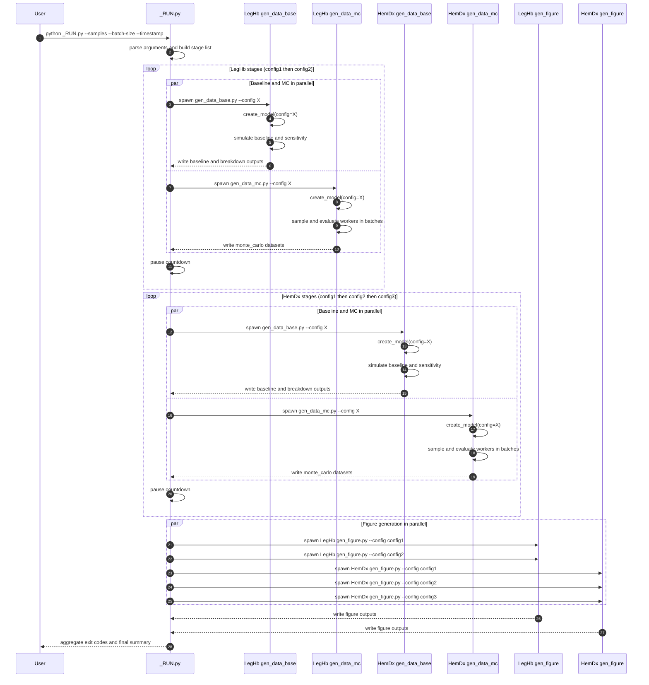
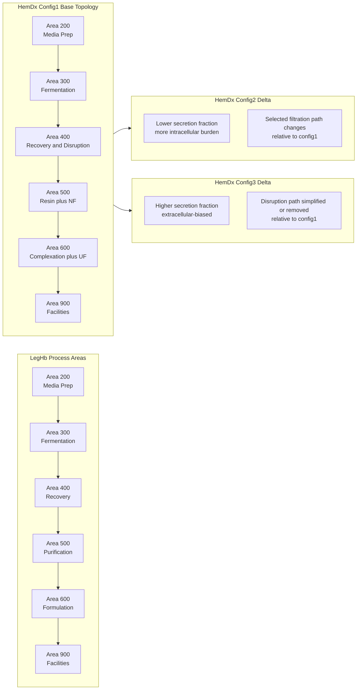

# PREFERS v2 Detailed Mermaid Architecture

Last updated: 2026-04-01
Scope: Shared v2 core plus LegHb and HemDx execution paths

## Diagram 1: End-to-End Dependency Topology

```mermaid
flowchart TB
    RUN["_RUN.py\nMaster Orchestrator"]

    subgraph LEGHB_SCRIPTS["LegHb Analysis Scripts"]
        L_BASE["LegHb/analyses/gen_data_base.py"]
        L_MC["LegHb/analyses/gen_data_mc.py"]
        L_FIG["LegHb/analyses/gen_figure.py"]
    end

    subgraph HEMDX_SCRIPTS["HemDx Analysis Scripts"]
        H_BASE["HemDx/analyses/gen_data_base.py"]
        H_MC["HemDx/analyses/gen_data_mc.py"]
        H_FIG["HemDx/analyses/gen_figure.py"]
    end

    subgraph LEGHB_MODEL_SYS["LegHb Model and System Routing"]
        L_MODEL["LegHb/_models.py\ncreate_model(config)"]
        L_SYS1["LegHb/system/_config1.py\ncreate_LegHb_system"]
        L_SYS2["LegHb/system/_config2.py\ncreate_LegHb_system"]
        L_TEA1["LegHb/_tea_config1.py\nPreFerSTEA"]
        L_TEA2["LegHb/_tea_config2.py\nPreFerSTEA"]
    end

    subgraph HEMDX_MODEL_SYS["HemDx Model and System Routing"]
        H_MODEL["HemDx/_models.py\ncreate_model(config)"]
        H_SYS1["HemDx/system/_config1.py\ncreate_NHemDx_system"]
        H_SYS2["HemDx/system/_config2.py\ncreate_NHemDx_system"]
        H_SYS3["HemDx/system/_config3.py\ncreate_NHemDx_system"]
        H_TEA1["HemDx/_tea_config1.py\nPreFerSTEA"]
        H_TEA2["HemDx/_tea_config2.py\nPreFerSTEA"]
        H_TEA3["HemDx/_tea_config3.py\nPreFerSTEA"]
    end

    subgraph SHARED_CORE["Shared v2 Core"]
        CORE_SET["_process_settings.py\nload_process_settings"]
        CORE_UNITS["_units.py and _units_adv.py\ncustom BioSTEAM units"]
        CORE_TEA["_tea.py\nbase PreFerSTEA"]
        CORE_UTIL["utils/\nutils.py report_generator.py\nsankey_utils.py plots.py style.py"]
    end

    subgraph OUTPUTS["Analysis Outputs"]
        OUT_DATA["results_<config>_<timestamp>/data\nbaseline, MC, breakdown, sankey"]
        OUT_FIG["results_<config>_<timestamp>/figure\ndistribution, sensitivity, correlation"]
    end

    RUN -->|"spawn baseline and MC in parallel per stage"| L_BASE
    RUN --> L_MC
    RUN --> L_FIG
    RUN --> H_BASE
    RUN --> H_MC
    RUN --> H_FIG

    L_BASE -->|"import create_model"| L_MODEL
    L_MC -->|"import create_model"| L_MODEL
    H_BASE -->|"import create_model"| H_MODEL
    H_MC -->|"import create_model"| H_MODEL

    L_MODEL -->|"config1"| L_SYS1
    L_MODEL -->|"config2"| L_SYS2
    L_MODEL -->|"config1"| L_TEA1
    L_MODEL -->|"config2"| L_TEA2

    H_MODEL -->|"config1"| H_SYS1
    H_MODEL -->|"config2"| H_SYS2
    H_MODEL -->|"config3"| H_SYS3
    H_MODEL -->|"config1"| H_TEA1
    H_MODEL -->|"config2"| H_TEA2
    H_MODEL -->|"config3"| H_TEA3

    L_SYS1 --> CORE_UNITS
    L_SYS2 --> CORE_UNITS
    H_SYS1 --> CORE_UNITS
    H_SYS2 --> CORE_UNITS
    H_SYS3 --> CORE_UNITS

    L_MODEL --> CORE_SET
    H_MODEL --> CORE_SET
    L_TEA1 --> CORE_TEA
    L_TEA2 --> CORE_TEA
    H_TEA1 --> CORE_TEA
    H_TEA2 --> CORE_TEA
    H_TEA3 --> CORE_TEA

    L_BASE --> CORE_UTIL
    L_MC --> CORE_UTIL
    L_FIG --> CORE_UTIL
    H_BASE --> CORE_UTIL
    H_MC --> CORE_UTIL
    H_FIG --> CORE_UTIL

    L_BASE --> OUT_DATA
    L_MC --> OUT_DATA
    H_BASE --> OUT_DATA
    H_MC --> OUT_DATA
    L_FIG --> OUT_FIG
    H_FIG --> OUT_FIG
```

## Diagram 2: Runtime Sequence Across All Stages

## Diagram 3: Process-Area Architecture and Config Deltas

## Notes

- Diagram 1 is best for dependency navigation and code ownership.
- Diagram 2 is best for understanding runtime orchestration and stage timing.
- Diagram 3 is best for process-level communication across config variants.
