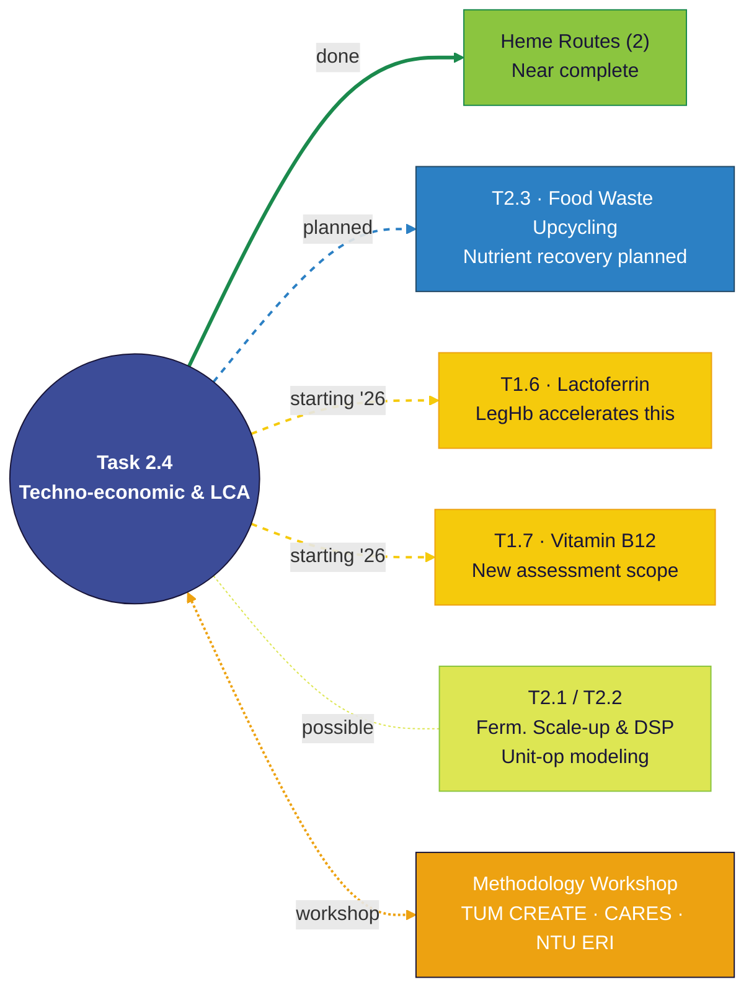

# Collaboration Relationship — Task 2.4

> **Purpose**: Single slide showing Task 2.4's collaboration network within CREATE and with external partners.
> **Usage**: Feed the **Figure Generation Prompt** below to Gemini for rendering with PreFerS visual language.
> The **Mermaid diagram** encodes the structural spec; the **prompt** specifies the visual output.

---

## Figure Generation Prompt

```markdown
Create one **hub-and-spoke connection diagram** for a **project review audience** with **content-only** output unless otherwise stated.

### Communication goal
- Main message: Task 2.4 is a collaborative hub — connected to 6 internal tasks and 3 external centres.
- Decision/use context: SAC meeting presentation — 1 slide near the end, shown quickly.
- What viewers should understand in 5 seconds: "Task 2.4 is broadly connected, not isolated."

### Content blocks (exact text or near-exact)

**Center hub (our team)**
- Block A — hub label:
  **Task 2.4 · Techno-economic & LCA**
  "Our core role"

**Completed work (solid connection)**
- Block B:
  **Heme Routes (2) — near complete**
  Two routes near-complete

**Discussed & planned (dashed connection)**
- Block C:
  **T2.3 · Food Waste Upcycling**
  Nutrient recovery — discussed, demo'd, planned

**Starting 2026 (dashed-gold connection)**
- Block D:
  **T1.6 · Lactoferrin**
  Our LegHb work accelerates development
- Block E:
  **T1.7 · Vitamin B12**
  New assessment scope

**Possible contribution (dotted connection)**
- Block F:
  **T2.1 / T2.2 · Ferm. Scale-up & DSP**
  Unit-op modeling contribution

**External collaboration (double-line orange connection)**
- Block G:
  **Methodology Workshop**
  TUM CREATE · CARES · NTU Energy Inst.

### Structure and layout
- Layout pattern: HUB-AND-SPOKE (radial)
- Hub placement: slightly above centre, offset right
- Reading order: RADIAL from hub outward
- Group bands (clockwise from top-right):
  1. ✅ Completed (top-right) — green zone
  2. 📋 Discussed & Planned (right) — blue zone
  3. 🆕 Starting 2026 (bottom-right) — gold zone
  4. ⚙️ Possible Contribution (bottom-centre) — yellow-green zone
  5. 🌐 External Partners (top-left) — orange zone
- **Bottom-left quadrant: LEAVE BLANK** (reserved for overlay text)
- Connector logic:
  - Solid thick line → completed
  - Dashed line (blue) → discussed & planned
  - Dashed line (gold) → starting 2026
  - Dotted thin line → possible contribution
  - Double line (orange) → external workshop
- Text density: max 2 lines per card (label + 1 descriptor)

### Visual system (mandatory)
- Canonical source palette (original PreFerS):
  `#191538 #3C4C98 #2C80C4 #234966 #1B8A4D #8BC53F #DDE653 #F5CA0C #EDA211`
- Specific colour assignments:
  - Hub (#3C4C98 medium blue, white text)
  - Completed card (#8BC53F light green)
  - Discussed card (#2C80C4 bright blue, white text)
  - Starting 2026 cards (#F5CA0C gold)
  - Possible card (#DDE653 yellow-green)
  - External card (#EDA211 orange, white text)
  - Connectors: coloured to match destination card category
- Render variant for fills/cards: `PreFerS_softlight`
- Overall style: soft-light, antiqued, simplified Material-inspired
- Background: warm off-white with subtle paper texture
- Borders: thin and low-contrast
- Shadows: shallow and soft

### Legibility constraints
- High contrast for text at presentation scale
- Keep each text block to 2 lines max
- Avoid clutter; prioritize hierarchy and spacing
- No icons — rely on colour coding and line style

### Output constraints
- Do NOT include title, takeaway quote, or footnote
- Target placement: right ¾ of slide in 16:9 deck (bottom-left ¼ blank)
- Visual intent: clear to general audience, credible to technical reviewers
- Aspect ratio: 16:9
```

---

## Mermaid Structural Spec



---

## Legend

| Line Style | Colour | Meaning | Example |
|---|---|---|---|
| ━━━ solid thick | Green `#1B8A4D` | Completed / near-complete | Heme Route |
| ┅┅┅ dashed | Blue `#2C80C4` | Discussed & planned | T2.3 Food Waste |
| ┅┅┅ dashed | Gold `#F5CA0C` | Starting 2026 | T1.6, T1.7 |
| ····· dotted | Yellow-green `#DDE653` | Possible contribution | T2.1/T2.2 |
| ═══ double | Orange `#EDA211` | External workshop | TUM CREATE / CARES / NTU |

---

## Rendering Notes

- **Bottom-left ¼ of the slide is intentionally blank** — reserved for text overlay.
- The Mermaid code above renders left-to-right for preview; the Gemini prompt requests a **radial hub-and-spoke** layout centred slightly above-right of the slide centre.
- For Gemini: paste the **Figure Generation Prompt** section as-is. The Mermaid block provides structural reference if needed.
