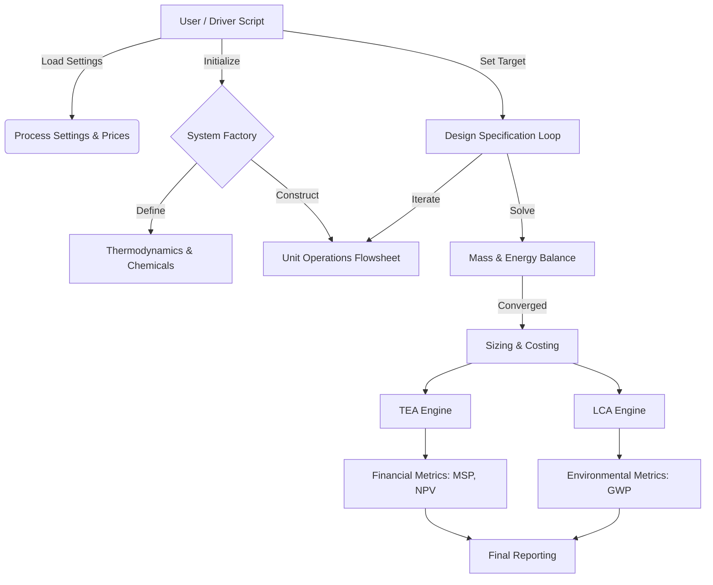

Here is the **Living Documentation Suite** for the **PREFERS v2** codebase. This documentation is structured to serve Product Managers, System Architects, Data Integrators, and Developers.

---

# PREFERS v2: Living Documentation Suite

**Version:** 2.0 (LegHb Production / HemDx Production)  
**Framework:** Python 3.12 (BioSTEAM, Thermosteam, Chaospy)  
**Context:** Bioindustrial Park / Precision Fermentation

---

## SECTION 1: SYSTEM OVERVIEW (The "Product Manager" View)

### Project Description
**PREFERS (Precision Fermentation Simulation)** is a modular, high-fidelity techno-economic and environmental assessment (TEA/LCA) framework. It simulates the industrial production of high-value heme products, including **Leghemoglobin (LegHb)** and **Heme-Cyclodextrin (HemDx)**, using BioSTEAM-based process models.

Unlike static spreadsheet models, PREFERS performs rigorous mass and energy balances, sizes equipment from first principles, and dynamically computes Minimum Selling Price (MSP) and Global Warming Potential (GWP) under uncertainty.

### Key Capabilities
1. **Integrated TEA & LCA:** Calculates economic metrics (MSP, CAPEX, AOC) and environmental impacts (GWP, FEC) within a single runtime.
2. **Singapore-Specific Economics:** `PreFerSTEA` implements IRAS depreciation schedules and Singapore tax assumptions.
3. **Design-Spec Driven Scaling:** Internalized design specifications (e.g., R302 titer + NH3 targets) resize the facility to meet production targets.
4. **Stochastic Uncertainty Analysis:** A Monte Carlo engine in product `_models.py` varies titer, yield, and price inputs.
5. **Modular Product Architecture:** Product modules (`LegHb`, `HemDx`) share common unit operations (`_units.py`, `_units_adv.py`) while preserving product-specific chemistry and systems.

### High-Level Workflow

---

## SECTION 2: ARCHITECTURAL HANDBOOK (The "Architect" View)

### Directory Structure & Intent
The system follows a package-subpackage pattern that separates shared infrastructure from product-specific logic.

- **`biorefineries/prefers/v2/` (Root Package):** Production environment.
  - `_process_settings.py`: Single source of truth for prices, utilities, and LCA factors.
  - `_units.py`: Shared custom `bst.Unit` subclasses.
  - `_units_adv.py`: Mechanistic/advanced variants for membrane and resin units.
  - `_tea.py`: `PreFerSTEA` base class with IRAS depreciation keys.
- **`LegHb/` (Product Subpackage):** Leghemoglobin process logic.
  - `_chemicals.py`: Product-specific species definitions.
  - `system/_config1.py`: Default flowsheet with internalized titer + NH3 specs.
  - `_models.py`: Uncertainty and sensitivity model.
- **`HemDx/` (Product Subpackage):** HemDx process logic.
  - `system/_config1.py`: Base secretion flowsheet.
  - `system/_config2.py`: Intracellular variant.
  - `system/_config3.py`: Extracellular variant.
  - `_models.py`: Uncertainty and sensitivity model.

### Design Patterns

#### 1. The System Factory Pattern
Flowsheets are assembled via `@bst.SystemFactory`, allowing re-instantiation for model runs without reloading Python.

#### 2. Internalized Design Specification (R302)
The primary production reactor embeds titer and NH3 targets in a specification that iterates within the system runtime. This enables robust convergence for production goals without external drivers.

#### 3. Custom TEA Inheritance
`PreFerSTEA` subclasses `bst.TEA` and overrides depreciation logic using IRAS keys (e.g., `('IRAS', 6)`).

---

## SECTION 3: THE DATA CONTRACT (The "Interface" View)

### Input Structure (Global Settings)
Defined in `_process_settings.py`, global dictionaries and helpers are loaded before simulation:

- `price`: Chemical and utility prices ($/kg or $/kWh).
- `GWP_CFs`: LCA characterization factors (kg CO2-eq per kg or kWh).
- `load_process_settings()`: Registers prices, utilities, and characterization factors in BioSTEAM.

### Output Structure (Results)
The system exports data at three levels:

1. **Stream Results:** Mass flows, compositions, and prices (via `sys.show()`).
2. **TEA Results:** MSP, cash flow table, and capital/operating breakdown.
3. **LCA Results:** GWP per kg product and contribution breakdowns.

### Product Specification Contract
Product quality checks are defined in each product system module. For details, see:
- [LegHb config 1](modules/01_LegHb/config1.md)
- [HemDx configs](modules/02_HemDx/config1.md)

---

## SECTION 4: MODULE CATALOG (The "Developer" View)

Custom unit operations are documented under `docs/units/` and listed in [Unit_Operations_Catalog.md](Unit_Operations_Catalog.md).

Key shared units include:
- Seed train and fermentation (`SeedTrain`, `AeratedFermentation`)
- Cell disruption and separation (`CellDisruption`, `Centrifuge`)
- Membranes (`Filtration`, `Diafiltration`, and advanced variants)
- Resin and polishing (`ResinColumn`, `ResinColumnAdv`)
- Utilities and supporting systems (`BoilerTurbogenerator`, `VacuumPSA`)

---

## SECTION 5: ANALYSIS WORKFLOW (The "Analyst" View)

### UA/SA Scripts (LegHb)
- `LegHb/analyses/gen_data_base.py`: Deterministic baseline evaluation.
- `LegHb/analyses/gen_data_mc.py`: Monte Carlo sampling runs.
- `LegHb/analyses/gen_figure.py`: Plot generation from saved results.

### Models
- `LegHb/_models.py` and `HemDx/_models.py` define parameters, metrics, and sampling methods.

---

*Last Updated: 2026-02-12*
