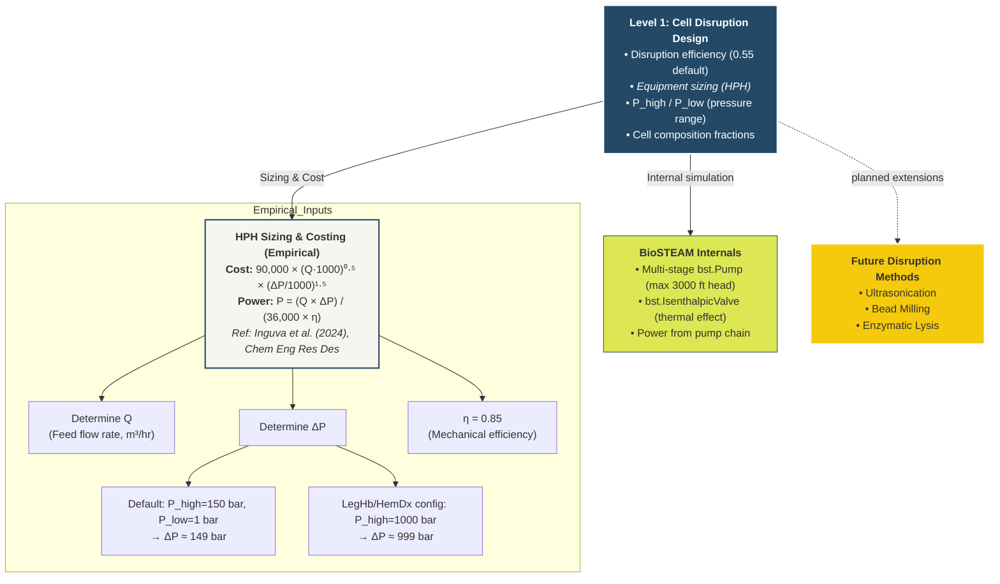

# CellDisruption — Design Algorithm

**Tier:** Empirical (uses BioSTEAM `bst.Pump` + empirical cost correlation)  
**Class:** `CellDisruption`  
**Module:** `biorefineries.prefers.v2._units.py`  
**Current Method:** High-Pressure Homogenizer (HPH)  
**Future Extensions:** Ultrasonication, Bead Milling, Enzymatic Lysis

---

## Textual Breakdown

- **Level 1: Cell Disruption Design** → [Disruption efficiency, *Equipment sizing (HPH)*, Pressure parameters, Cell composition, Future methods]
- **Level 2 + Level 4 (merged): HPH Sizing & Costing** →

  **Cost Correlation (Inguva et al. 2024):**
  $$\text{Cost} = 90{,}000 \times (Q \times 1000)^{0.5} \times \left(\frac{\Delta P}{1000}\right)^{1.5}$$

  **Power Consumption:**
  $$P_{kW} = \frac{Q_{L/hr} \times \Delta P_{bar}}{36{,}000 \times \eta}$$

  - **Determine $Q$:** Feed volumetric flow rate (m³/hr → L/hr)
  - **Determine $\Delta P$:** $P_{\text{high}} - P_{\text{low}}$ (default: 150 bar − 1.01 bar ≈ 149 bar; LegHb/HemDx config: 1000 bar)
  - **Determine $\eta$:** Mechanical efficiency = 0.85

  **Internal Mechanics (BioSTEAM):**
  - Multi-stage `bst.Pump` system (max head 3000 ft, max ratio 4.0 per stage)
  - `bst.IsenthalpicValve` for thermal effect (Joule-Thomson temperature rise)
  - Cell wall components released by `cell_disruption_efficiency` (default 0.55)

---

## Mermaid Diagram



---

## Equipment Illustration (Optional)

> **`SHOW_EQUIPMENT_ICON = ON`** — change to `OFF` to hide.

| Property | Value |
|:---------|:------|
| Equipment (Current) | High-Pressure Homogenizer (HPH) |
| Icon style | 2D flat / Material Design silhouette |
| Features | Plunger/piston body, pressure gauge icon, inlet/outlet arrows, valve symbol |
| Colors | Monochrome `#234966` on `#f7f5ef` |
| Size | ~80×80 px at 16:9 slide scale |
| Position | Outside L1 node, top-right |
| Future icons | Ultrasonic probe (probe + wave lines), Bead mill (cylinder + beads/shaft), Enzymatic (flask + enzyme symbol) — drawn only when method is implemented |

---

## Gemini Figure-Generation Prompt

```
Create one **Design Algorithm Drill-Down Diagram (Empirical)** for a technical audience (SAC meeting) with content-only output.

### Communication goal
- Main message: Show the compact design logic of CellDisruption — an empirical HPH sizing model with planned future method extensions
- Decision/use context: TEA design review for PreFerS biorefinery
- 5-second takeaway: HPH cost and power are simple empirical functions of flow rate Q and pressure drop ΔP, with internal BioSTEAM pump simulation for thermodynamic accuracy

### Content nodes (compact hierarchy + side references)
1. **Cell Disruption Design** (L1) — Disruption efficiency (0.55 default), Equipment sizing (HPH), P_high / P_low pressure range, Cell composition fractions
2. **HPH Sizing & Costing** (merged L2+L4) — Cost = 90,000 × (Q·1000)^0.5 × (ΔP/1000)^1.5; Power = Q·ΔP/(36,000·η); Ref: Inguva et al. 2024
3. **Empirical inputs** — Q = feed volumetric flow rate; ΔP: default ≈ 149 bar or LegHb/HemDx config ≈ 999 bar; η = 0.85
4. **BioSTEAM internals** (info box) — Multi-stage bst.Pump, bst.IsenthalpicValve for thermal effect, power from pump chain
5. **Future disruption methods** (dashed, planned) — Ultrasonication, Bead Milling, Enzymatic Lysis

### Structure and layout
- Layout pattern: COMPACT TOP-DOWN (L1 → merged equation block → inputs; side references for BioSTEAM internals and future)
- Reading order: TOP_TO_BOTTOM
- Future extensions box as a dashed-connected side element (amber)
- BioSTEAM internals as a small info box (yellow-green)
- Connector logic: solid arrows for sizing, dashed for planned/internal references
- Text density: 2-3 lines per block (most compact tier)

### Visual system (mandatory)
- Canonical source palette: #191538 #3C4C98 #2C80C4 #234966 #1B8A4D #8BC53F #DDE653 #F5CA0C #EDA211
- Render variant: PreFerS_softlight
- Level 1: #234966 (dark steel blue)
- Equation block: #f7f5ef (warm paper) with #234966 border
- Future extensions: #F5CA0C (amber)
- BioSTEAM internals: #DDE653 (yellow-green) with thin #234966 border
- Overall style: soft-light, antiqued, simplified Material-inspired
- Background: warm off-white with subtle paper texture
- Connectors: dark desaturated blue-gray (#4a5568)

### Legibility constraints
- High contrast text at presentation scale
- Keep diagram compact — this is the simplest tier
- Clear separation between "our equations" and "BioSTEAM library internals"
- Future box clearly marked as planned/not-yet-implemented

### Equipment illustration (SHOW_EQUIPMENT_ICON = OFF)
- No equipment illustrations. Logic diagram only.
<!-- When ON, replace the above with:
### Equipment illustration (SHOW_EQUIPMENT_ICON = ON)
- Place a small 2D flat/Material-Design equipment icon adjacent to the Level 1 node
- Equipment: High-Pressure Homogenizer — plunger/piston body with pressure gauge, inlet/outlet arrows
- Colors: monochrome #234966 silhouette on #f7f5ef background
- Size: small (~80×80 px), positioned outside the logic flow (top-right of L1)
- Style: simplified silhouette, thin #234966 border, subtle shadow, rounded corners
- Label: "HPH" in small text below the icon
- (Future icons for Ultrasonication, Bead Mill, Enzymatic — add only when implemented)
-->

### Output constraints
- No title bar, no footnote
- 16:9 slide placement
- Credible to technical audience, clear to general readers
```
