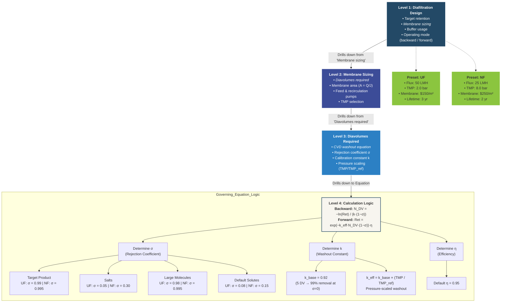

# DiafiltrationAdv — Design Algorithm

**Tier:** Full (4-level drill-down)  
**Class:** `DiafiltrationAdv`  
**Module:** `biorefineries.prefers.v2._units_adv`  
**Presets:** UF (Ultrafiltration), NF (Nanofiltration)  
**Modes:** Backward (set retention → calc DV), Forward (set DV → calc retention)

---

## Textual Breakdown

- **Level 1: Diafiltration Design** → [Target retention, *Membrane sizing*, Buffer usage, Operating mode]
- **Level 2: Membrane Sizing** → [*Diavolumes required*, Membrane area, Feed/recirc pumps, TMP selection]
- **Level 3: Diavolumes Required** → [*CVD washout equation*, Rejection coefficient σ, Calibration constant k, Pressure scaling]
- **Level 4: Calculation Equation & Logic Tree** →

  **Backward Mode — Governing Equation:**
  $$N_{DV} = \frac{-\ln(\text{Retention})}{k \cdot (1 - \sigma)}$$

  **Forward Mode — Retention from DV:**
  $$\text{Retention} = \exp\!\bigl(-k_{\text{eff}} \times N_{DV} \times (1 - \sigma)\bigr) \times \eta$$

  - **Determine $\sigma$ (Rejection Coefficient):**
    | Preset | Target Product | Salts | Large Molecules | Default Solutes |
    |--------|---------------|-------|-----------------|-----------------|
    | UF     | 0.99          | 0.05  | 0.98            | 0.08            |
    | NF     | 0.995         | 0.30  | 0.995           | 0.15            |

  - **Determine $k$ (Washout Constant):**
    - $k_{\text{base}} = 0.92$ (calibrated: 5 DV → 99% removal at $\sigma = 0$)
    - $k_{\text{eff}} = k_{\text{base}} \times \frac{TMP}{TMP_{\text{ref}}}$ (pressure scaling)

  - **Determine $\eta$ (Efficiency):**
    - Default: $\eta = 0.95$

  **Membrane Area Sizing:**
  $$A = \frac{Q_{\text{permeate}}}{J_{\text{eff}}}$$
  where $J_{\text{eff}} = J_{\text{ref}} \times \frac{TMP}{TMP_{\text{ref}}}$ (Darcy's law)

---

## Mermaid Diagram



---

## Equipment Illustration (Optional)

> **`SHOW_EQUIPMENT_ICON = ON`** — change to `OFF` to hide.

| Property | Value |
|:---------|:------|
| Equipment | TFF cassette module with recirculation loop |
| Icon style | 2D flat / Material Design silhouette |
| Features | Hollow-fiber or flat-sheet cassette body, retentate return arrow, permeate exit arrow, feed-in arrow |
| Colors | Monochrome `#234966` on `#f7f5ef` |
| Size | ~80×80 px at 16:9 slide scale |
| Position | Outside L1 node, top-right |

---

## Gemini Figure-Generation Prompt

```
Create one **Design Algorithm Drill-Down Diagram** for a technical audience (SAC meeting) with content-only output.

### Communication goal
- Main message: Show the hierarchical design logic of the DiafiltrationAdv unit operation
- Decision/use context: TEA design review for PreFerS biorefinery
- 5-second takeaway: Diafiltration sizing flows from target retention through the CVD washout equation to diavolumes and membrane area

### Content nodes (hierarchical, connected top-to-bottom)
1. **Diafiltration Design** (L1) — Target retention, Membrane sizing, Buffer usage, Operating mode (backward/forward)
2. **Membrane Sizing** (L2) — Diavolumes required, Membrane area (A = Q/J), Feed & recirc pumps, TMP selection
3. **Diavolumes Required** (L3) — CVD washout equation, Rejection coefficient σ, Calibration constant k, Pressure scaling
4. **Calculation Logic** (L4) — Backward: N_DV = −ln(Ret)/(k·(1−σ)); Forward: Ret = exp(−k_eff·N_DV·(1−σ))·η
5. **Determine σ** — UF vs NF preset values for target product / salts / large molecules / default solutes
6. **Determine k** — k_base = 0.92; k_eff = k_base × (TMP / TMP_ref)
7. **Determine η** — Default 0.95
8. **Presets** (side boxes) — UF (50 LMH, 2 bar, $150/m², 3 yr) and NF (25 LMH, 8 bar, $250/m², 2 yr)

### Structure and layout
- Layout pattern: TOP-DOWN FLOW (L1 → L2 → L3 → L4 → logic branches)
- Reading order: TOP_TO_BOTTOM
- Group bands: Levels as main nodes, Logic branches in a subgroup
- Connector logic: solid arrows for drill-down, dashed arrows for presets
- Text density: 2-4 lines per block

### Visual system (mandatory)
- Canonical source palette: #191538 #3C4C98 #2C80C4 #234966 #1B8A4D #8BC53F #DDE653 #F5CA0C #EDA211
- Render variant: PreFerS_softlight
- Level hierarchy: L1=#234966 (dark steel blue), L2=#3C4C98 (indigo), L3=#2C80C4 (sky blue), L4=#f7f5ef (warm paper)
- Preset boxes: #8BC53F (lime green)
- Overall style: soft-light, antiqued, simplified Material-inspired
- Background: warm off-white with subtle paper texture
- Borders: thin and low-contrast
- Shadows: shallow and soft
- Connectors: dark desaturated blue-gray (#4a5568)

### Legibility constraints
- High contrast text at presentation scale
- Keep each block to 2–4 lines
- Minimize clutter; prioritize hierarchy and spacing
- Equations rendered clearly with proper math formatting

### Equipment illustration (SHOW_EQUIPMENT_ICON = OFF)
- No equipment illustrations. Logic diagram only.
<!-- When ON, replace the above with:
### Equipment illustration (SHOW_EQUIPMENT_ICON = ON)
- Place a small 2D flat/Material-Design equipment icon adjacent to the Level 1 node
- Equipment: TFF cassette module with recirculation loop (hollow-fiber or flat-sheet silhouette, retentate/permeate arrows)
- Colors: monochrome #234966 silhouette on #f7f5ef background
- Size: small (~80×80 px), positioned outside the logic flow (top-right of L1)
- Style: simplified silhouette, thin #234966 border, subtle shadow, rounded corners
- Label: "TFF Module" in small text below the icon
-->

### Output constraints
- No title bar, no footnote
- 16:9 slide placement
- Credible to technical audience, clear to general readers
```
