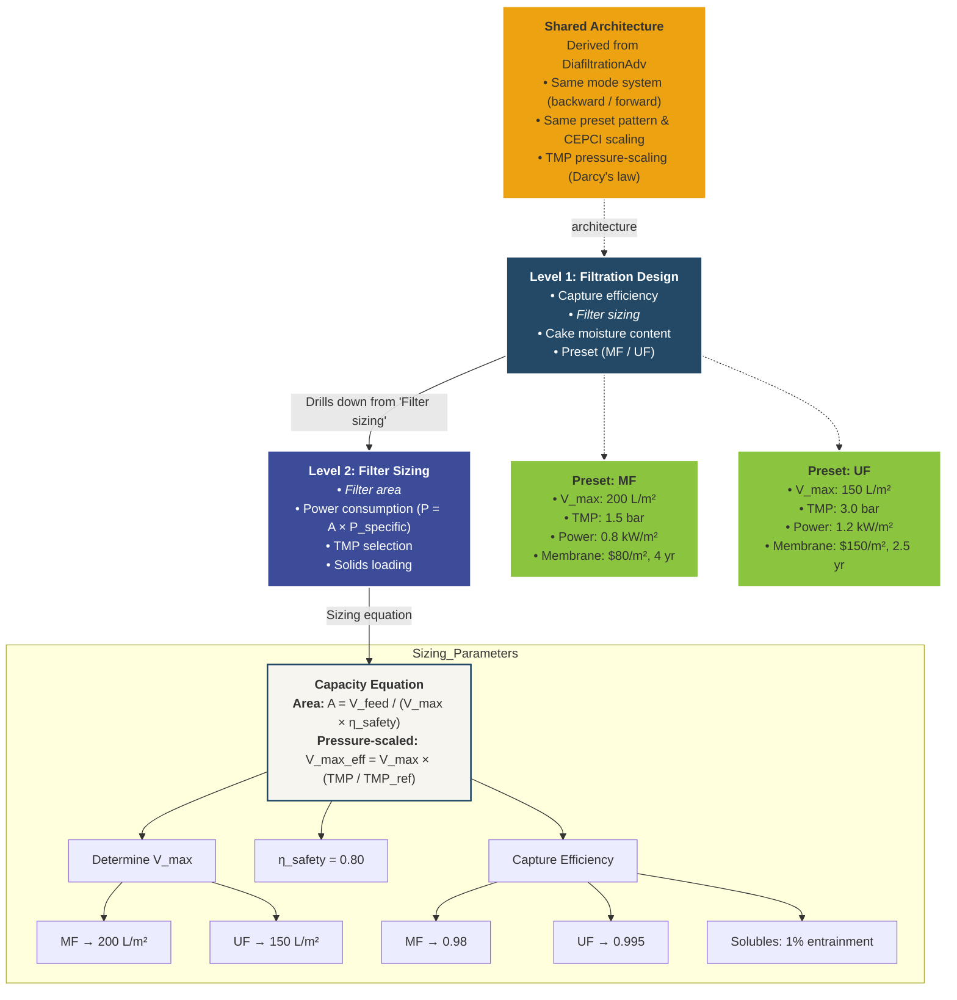

# FiltrationAdv — Design Algorithm

**Tier:** Derived (simplified — shares architecture with DiafiltrationAdv)  
**Class:** `FiltrationAdv`  
**Module:** `biorefineries.prefers.v2._units_adv`  
**Presets:** MF (Microfiltration), UF (Ultrafiltration)  
**Modes:** Backward (set capture efficiency → calc area), Forward (set area → capacity-limited)

---

## Textual Breakdown

- **Level 1: Filtration Design** → [Capture efficiency, *Filter sizing*, Cake moisture, Presets (MF/UF)]
- **Level 2: Filter Sizing** → [*Filter area*, Power consumption, TMP selection, Solids loading]
- **Level 4: Capacity Equation** →

  **Dead-End Sizing (Governing Equation):**
  $$A = \frac{V_{\text{feed}}}{V_{\max} \times \eta_{\text{safety}}}$$

  **Pressure-Scaled Capacity (Darcy's Law):**
  $$V_{\max,\text{eff}} = V_{\max} \times \frac{TMP}{TMP_{\text{ref}}}$$

  **Power:**
  $$P = A \times P_{\text{specific}}$$

  - **Determine $V_{\max}$:**
    - MF preset → 200 L/m²
    - UF preset → 150 L/m²

  - **Determine $\eta_{\text{safety}}$:**
    - Default → 0.80

  - **Determine Capture Efficiency:**
    - MF → 0.98 (cells & solids)
    - UF → 0.995 (finer separation)
    - Solubles: 1% entrainment in cake

> **Architecture Note:** FiltrationAdv shares the same bidirectional mode system (backward/forward), preset pattern, CEPCI-scaled costing, and TMP pressure-scaling as [DiafiltrationAdv](DiafiltrationAdv_design_algorithm.md). The key difference is that Filtration uses a **dead-end capacity model** instead of the **CVD washout model**.

---

## Mermaid Diagram



---

## Equipment Illustration (Optional)

> **`SHOW_EQUIPMENT_ICON = ON`** — change to `OFF` to hide.

| Property | Value |
|:---------|:------|
| Equipment | Flat membrane filter housing (dead-end) |
| Icon style | 2D flat / Material Design silhouette |
| Features | Flat sheet or disc membrane, cake layer on top surface, feed arrow (top-down), filtrate arrow (below), housing outline |
| Colors | Monochrome `#234966` on `#f7f5ef` |
| Size | ~80×80 px at 16:9 slide scale |
| Position | Outside L1 node, top-right |

---

## Gemini Figure-Generation Prompt

```
Create one **Design Algorithm Drill-Down Diagram (Derived)** for a technical audience (SAC meeting) with content-only output.

### Communication goal
- Main message: Show the simplified design logic of FiltrationAdv, derived from DiafiltrationAdv architecture
- Decision/use context: TEA design review for PreFerS biorefinery
- 5-second takeaway: Filtration uses a dead-end capacity model (A = V/V_max) instead of the CVD washout model, but shares the same mode system and scaling as Diafiltration

### Content nodes (compact hierarchy + cross-reference)
1. **Shared Architecture** (reference box) — Derived from DiafiltrationAdv; same mode system (backward/forward), preset pattern, CEPCI scaling, Darcy's law TMP scaling
2. **Filtration Design** (L1) — Capture efficiency, Filter sizing, Cake moisture content, Preset (MF / UF)
3. **Filter Sizing** (L2) — Filter area, Power consumption (P = A × P_specific), TMP selection, Solids loading
4. **Capacity Equation** (L4) — A = V_feed / (V_max × η_safety); V_max_eff = V_max × (TMP / TMP_ref)
5. **Sizing parameters** — V_max: MF → 200 L/m², UF → 150 L/m²; η_safety = 0.80
6. **Capture efficiency** — MF → 0.98, UF → 0.995; Solubles: 1% entrainment in cake
7. **Presets** (side boxes) — MF (200 L/m², 1.5 bar, 0.8 kW/m², $80/m², 4 yr) and UF (150 L/m², 3.0 bar, 1.2 kW/m², $150/m², 2.5 yr)

### Structure and layout
- Layout pattern: TOP-DOWN FLOW (compact — 3 vertical nodes + side presets)
- Reading order: TOP_TO_BOTTOM
- Reference box at top-left linking to DiafiltrationAdv (dashed connector)
- Connector logic: solid arrows for drill-down, dashed for presets and cross-reference
- Text density: 2-4 lines per block (more compact than Full-tier diagrams)

### Visual system (mandatory)
- Canonical source palette: #191538 #3C4C98 #2C80C4 #234966 #1B8A4D #8BC53F #DDE653 #F5CA0C #EDA211
- Render variant: PreFerS_softlight
- Level hierarchy: L1=#234966, L2=#3C4C98, L4=#f7f5ef
- Cross-reference box: #EDA211 (orange)
- Preset boxes: #8BC53F (lime green)
- Overall style: soft-light, antiqued, simplified Material-inspired
- Background: warm off-white with subtle paper texture
- Connectors: dark desaturated blue-gray (#4a5568)

### Legibility constraints
- High contrast text at presentation scale
- Keep diagram compact (fewer levels than Full-tier)
- Clear visual distinction between "own" logic and "shared architecture" reference

### Equipment illustration (SHOW_EQUIPMENT_ICON = OFF)
- No equipment illustrations. Logic diagram only.
<!-- When ON, replace the above with:
### Equipment illustration (SHOW_EQUIPMENT_ICON = ON)
- Place a small 2D flat/Material-Design equipment icon adjacent to the Level 1 node
- Equipment: Flat membrane filter housing with dead-end flow (disc membrane, cake layer, feed/filtrate arrows)
- Colors: monochrome #234966 silhouette on #f7f5ef background
- Size: small (~80×80 px), positioned outside the logic flow (top-right of L1)
- Style: simplified silhouette, thin #234966 border, subtle shadow, rounded corners
- Label: "Dead-End Filter" in small text below the icon
-->

### Output constraints
- No title bar, no footnote
- 16:9 slide placement
- Credible to technical audience, clear to general readers
```
