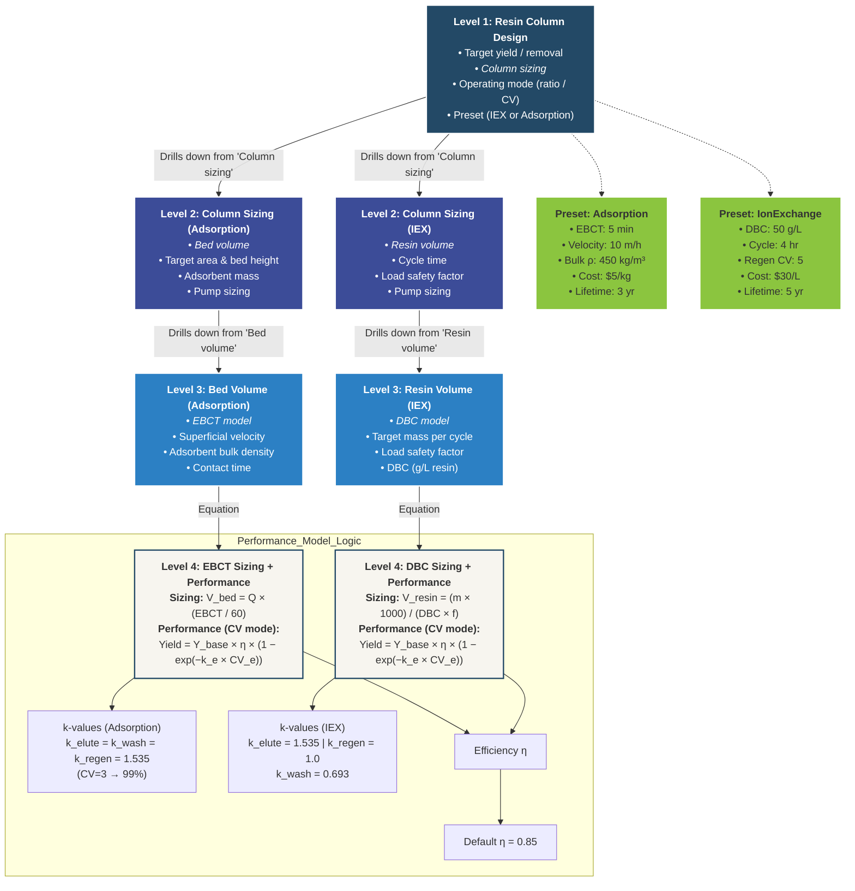

# ResinColumnAdv — Design Algorithm

**Tier:** Full (4-level drill-down)  
**Class:** `ResinColumnAdv`  
**Module:** `biorefineries.prefers.v2._units_adv`  
**Presets:** IonExchange, Adsorption  
**Modes:** Ratio (set performance targets → back-calc CVs), CV (set CVs → calc performance)

---

## Textual Breakdown

### Adsorption Preset Path
- **Level 1: Resin Column Design** → [Target yield, *Column sizing*, Operating mode (ratio/CV), Preset selection]
- **Level 2: Column Sizing (Adsorption)** → [*Bed volume*, Target area, Bed height, Adsorbent mass, Pump sizing]
- **Level 3: Bed Volume** → [*EBCT model*, Superficial velocity, Adsorbent bulk density, Contact time]
- **Level 4: EBCT Equation & Performance Logic** →

  **Sizing Equation:**
  $$V_{\text{bed}} = Q \times \frac{EBCT_{\text{min}}}{60}$$

  **Performance (CV Mode):**
  $$\text{Yield} = Y_{\text{base}} \times \eta \times (1 - e^{-k_{\text{elute}} \times CV_{\text{elute}}})$$
  $$R_{\text{wash}} = R_{\text{base,wash}} \times \eta \times (1 - e^{-k_{\text{wash}} \times CV_{\text{wash}}})$$
  $$R_{\text{regen}} = R_{\text{base,regen}} \times \eta \times (1 - e^{-k_{\text{regen}} \times CV_{\text{regen}}})$$

  - **Determine $k$ values (Adsorption):**
    - $k_{\text{elute}} = 1.535$ (calibrated: CV=3 → 99% factor)
    - $k_{\text{wash}} = 1.535$
    - $k_{\text{regen}} = 1.535$

  - **Determine $\eta$ (Efficiency):**
    - Default $\eta = 0.85$

### Ion Exchange Preset Path
- **Level 2: Column Sizing (IEX)** → [*Resin volume*, Cycle time, Load safety factor, Pump sizing]
- **Level 3: Resin Volume** → [*DBC model*, Target mass, Safety factor]
- **Level 4: DBC Equation & Performance Logic** →

  **Sizing Equation:**
  $$V_{\text{resin}} = \frac{m_{\text{target}} \times 1000}{DBC \times f_{\text{safety}}}$$

  **Performance (CV Mode):**
  $$\text{Yield} = Y_{\text{base}} \times \eta \times (1 - e^{-k_{\text{elute}} \times CV_{\text{elute}}})$$
  $$R_{\text{removal}} = R_{\text{base}} \times \eta \times (1 - e^{-k_{\text{regen}} \times CV_{\text{regen}}})$$
  $$\text{Carryover} = C_{\text{base}} \times e^{-k_{\text{wash}} \times CV_{\text{wash}}} / \eta$$

  - **Determine $k$ values (IEX):**
    - $k_{\text{elute}} = 1.535$
    - $k_{\text{regen}} = 1.0$ (CV=5 → 99.3%)
    - $k_{\text{wash}} = 0.693$ (ln(2)/1, CV=5 → 97%)

---

## Mermaid Diagram



---

## Equipment Illustration (Optional)

> **`SHOW_EQUIPMENT_ICON = ON`** — change to `OFF` to hide.

| Property | Value |
|:---------|:------|
| Equipment | Vertical packed chromatography column |
| Icon style | 2D flat / Material Design silhouette |
| Features | Cylindrical body, packed resin bed fill pattern, 4 stream arrows (feed in, product out, wash in, regenerant in/out) |
| Colors | Monochrome `#234966` on `#f7f5ef` |
| Size | ~80×80 px at 16:9 slide scale |
| Position | Outside L1 node, top-right |

---

## Gemini Figure-Generation Prompt

```
Create one **Design Algorithm Drill-Down Diagram** for a technical audience (SAC meeting) with content-only output.

### Communication goal
- Main message: Show the hierarchical design logic of the ResinColumnAdv unit with dual preset branches (Adsorption vs Ion Exchange)
- Decision/use context: TEA design review for PreFerS biorefinery
- 5-second takeaway: ResinColumn sizing branches into EBCT (Adsorption) or DBC (Ion Exchange), both sharing an exponential performance model for Yield/Removal vs Column Volumes

### Content nodes (hierarchical, branching at L2)
1. **Resin Column Design** (L1) — Target yield / removal, Column sizing, Operating mode (ratio / CV), Preset selection
2a. **Column Sizing — Adsorption** (L2) — Bed volume, Target area & bed height, Adsorbent mass, Pump sizing
2b. **Column Sizing — IEX** (L2) — Resin volume, Cycle time, Load safety factor, Pump sizing
3a. **Bed Volume** (L3, Adsorption) — EBCT model, Superficial velocity, Bulk density, Contact time
3b. **Resin Volume** (L3, IEX) — DBC model, Target mass per cycle, Safety factor
4a. **EBCT Sizing + Performance** (L4) — V_bed = Q × (EBCT/60); Yield = Y × η × (1 − exp(−k·CV))
4b. **DBC Sizing + Performance** (L4) — V_resin = (m × 1000)/(DBC × f); same yield model
5. **k-values** — Adsorption: all 1.535; IEX: k_e = 1.535, k_r = 1.0, k_w = 0.693
6. **Efficiency** — η = 0.85
7. **Presets** (side boxes) — Adsorption (EBCT=5 min, v=10 m/h, ρ=450, $5/kg, 3 yr) and IEX (DBC=50 g/L, 4 hr cycle, $30/L, 5 yr)

### Structure and layout
- Layout pattern: TOP-DOWN FLOW with BRANCH at L2 (two parallel columns)
- Reading order: TOP_TO_BOTTOM, then left (Adsorption) / right (IEX)
- Group bands: Shared L1 at top, branching at L2, shared logic subgroup at bottom
- Connector logic: solid arrows for drill-down, dashed arrows for presets
- Text density: 2-4 lines per block

### Visual system (mandatory)
- Canonical source palette: #191538 #3C4C98 #2C80C4 #234966 #1B8A4D #8BC53F #DDE653 #F5CA0C #EDA211
- Render variant: PreFerS_softlight
- Level hierarchy: L1=#234966, L2=#3C4C98, L3=#2C80C4, L4=#f7f5ef
- Preset boxes: #8BC53F
- Overall style: soft-light, antiqued, simplified Material-inspired
- Background: warm off-white with subtle paper texture
- Borders: thin and low-contrast
- Shadows: shallow and soft
- Connectors: dark desaturated blue-gray (#4a5568)

### Legibility constraints
- High contrast text at presentation scale
- Keep each block to 2–4 lines
- Minimize clutter; prioritize hierarchy and spacing
- Two-column layout must remain balanced

### Equipment illustration (SHOW_EQUIPMENT_ICON = OFF)
- No equipment illustrations. Logic diagram only.
<!-- When ON, replace the above with:
### Equipment illustration (SHOW_EQUIPMENT_ICON = ON)
- Place a small 2D flat/Material-Design equipment icon adjacent to the Level 1 node
- Equipment: Vertical packed chromatography column (cylindrical body, resin bed fill, 4 stream arrows)
- Colors: monochrome #234966 silhouette on #f7f5ef background
- Size: small (~80×80 px), positioned outside the logic flow (top-right of L1)
- Style: simplified silhouette, thin #234966 border, subtle shadow, rounded corners
- Label: "Resin Column" in small text below the icon
-->

### Output constraints
- No title bar, no footnote
- 16:9 slide placement
- Credible to technical audience, clear to general readers
```
