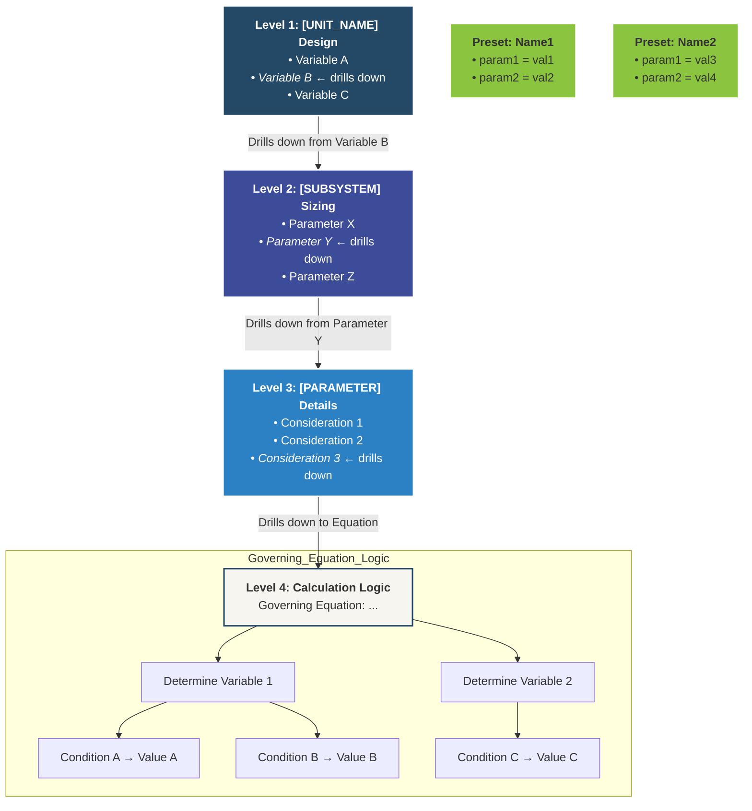
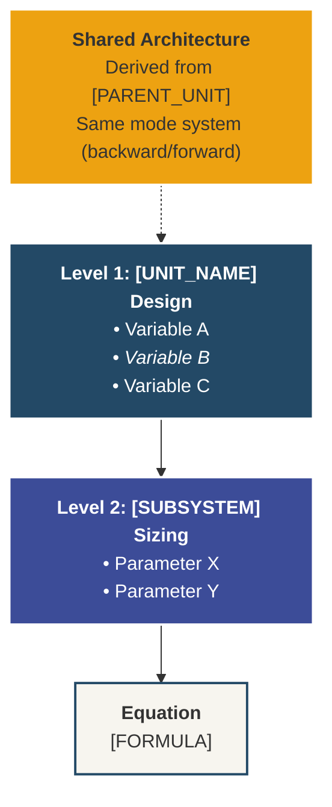
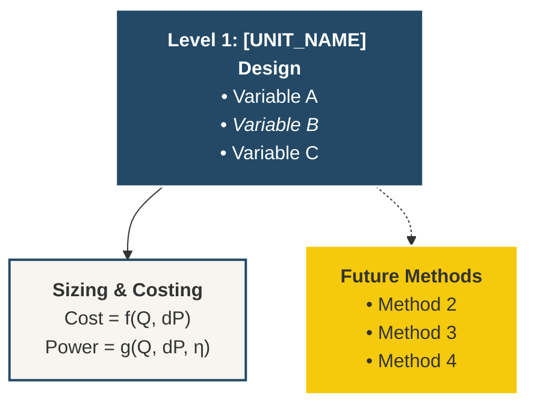

# Unit Operation Design Algorithm — Figure Template

**Purpose:** Generate hierarchical "Design Algorithm" figures for PreFerS custom unit operations, mapping the design process from high-level equipment parameters down to granular calculation logic.

**Visual System:** PreFerS_softlight  
**Target:** Gemini figure generation via Mermaid prompt  
**Last Updated:** 2026-02-16

---

## 1. Four-Level Drill-Down Architecture

Every design algorithm figure follows a strict 4-level hierarchy:

| Level | Name | Content | Visual Weight |
|:------|:-----|:--------|:--------------|
| **L1** | Unit Operation Design | The primary equipment and its high-level design variables | Heaviest — anchor |
| **L2** | Sub-system / Component Sizing | Detailed breakdown of one selected L1 variable | Medium |
| **L3** | Specific Parameter Details | Further breakdown of a critical L2 component | Light |
| **L4** | Calculation Logic Tree | Governing equation + conditional decision tree | Outlined / paper |

> **Drill-down rule:** Each level selects *one* item from the previous level (marked in bold/italic) and expands it. Other items remain listed but not expanded.

---

## 2. Complexity Tiers

Not all unit operations require the full 4-level treatment:

| Tier | Levels Used | When to Use | Example |
|:-----|:-----------|:------------|:--------|
| **Full** | L1 → L2 → L3 → L4 | Fully custom unit with mechanistic models | DiafiltrationAdv, ResinColumnAdv |
| **Derived** | L1 → L2 → L4 (compact) | Shares architecture with a Full-tier unit; a reference box links to the parent | FiltrationAdv (derived from DiafiltrationAdv) |
| **Empirical** | L1 → L2+L4 (merged) | Uses built-in BioSTEAM equipment + empirical correlation | CellDisruption (HPH) |

---

## 3. PreFerS_softlight Color System

Canonical palette: `#191538 #3C4C98 #2C80C4 #234966 #1B8A4D #8BC53F #DDE653 #F5CA0C #EDA211`

### Design Algorithm Color Mapping

```
classDef level1 fill:#234966,stroke:#fff,stroke-width:2px,color:#fff;
classDef level2 fill:#3C4C98,stroke:#fff,stroke-width:2px,color:#fff;
classDef level3 fill:#2C80C4,stroke:#fff,stroke-width:2px,color:#fff;
classDef logic  fill:#f7f5ef,stroke:#234966,stroke-width:2px,color:#333;
classDef preset fill:#8BC53F,stroke:#fff,stroke-width:2px,color:#333;
classDef future fill:#F5CA0C,stroke:#fff,stroke-width:2px,color:#333;
classDef ref    fill:#EDA211,stroke:#fff,stroke-width:2px,color:#333;
```

| Role | Color | Hex | Usage |
|:-----|:------|:----|:------|
| Level 1 | Dark Steel Blue | `#234966` | Top-level unit node |
| Level 2 | Indigo Blue | `#3C4C98` | Sub-system sizing node |
| Level 3 | Sky Blue | `#2C80C4` | Parameter detail node |
| Level 4 / Logic | Warm Paper | `#f7f5ef` | Equation + decision branches |
| Preset | Lime Green | `#8BC53F` | Preset variant boxes (UF/NF/MF, IEX/Adsorption) |
| Future Extension | Amber | `#F5CA0C` | Planned but not yet implemented methods |
| Cross-Reference | Orange | `#EDA211` | Link to parent/related unit architecture |
| Connectors | Blue-Gray | `#4a5568` | Arrow/edge lines |

### Style Guidelines
- **Background:** warm off-white with subtle paper texture
- **Borders:** thin and low-contrast (white for filled nodes, palette for logic nodes)
- **Shadows:** shallow and soft
- **Text:** high contrast at presentation scale; keep each block to 2–4 lines

---

## 4. Equipment Illustration Option

> **Toggle: `SHOW_EQUIPMENT_ICON`** — set to `ON` or `OFF` per figure.

When **ON**, a small 2D equipment illustration accompanies the Level 1 node. These are **not** inside the logic boxes — they float outside, adjacent to L1.

### Illustration Specifications

| Property | Value |
|:---------|:------|
| Style | 2D flat / Material Design, simplified silhouette |
| Color | Monochrome using `#234966` (dark steel blue) on `#f7f5ef` (warm paper) |
| Size | Small — roughly 80×80 px equivalent at 16:9 slide scale |
| Position | Outside L1 node, top-right or left margin |
| Border | Thin `#234966` stroke, rounded corners, subtle shadow |
| Label | Equipment name in 8-10 pt below the icon |

### Equipment Icon Catalog

| Unit Operation | Icon Description | Notes |
|:---------------|:----------------|:------|
| DiafiltrationAdv | TFF cassette module with recirculation loop | Hollow-fiber or flat-sheet silhouette, retentate/permeate arrows |
| ResinColumnAdv | Vertical packed column with inlet/outlet ports | Cylindrical body, resin bed fill pattern, 4 stream arrows |
| FiltrationAdv | Flat membrane sheet with cake layer | Dead-end flow arrow, cake on top, filtrate below |
| CellDisruption (HPH) | High-pressure homogenizer body | Plunger/piston silhouette, pressure gauge icon |
| CellDisruption (Future: Ultrasonication) | Ultrasonic probe in vessel | Probe tip with wave lines |
| CellDisruption (Future: Bead Mill) | Horizontal bead mill chamber | Cylinder with beads, rotating agitator shaft |
| CellDisruption (Future: Enzymatic) | Flask with enzyme symbol | Erlenmeyer flask, simplified enzyme/lock-key icon |

### Mermaid Integration

When `SHOW_EQUIPMENT_ICON = ON`, add a classDef and node to the Mermaid:

```
classDef equip fill:#f7f5ef,stroke:#234966,stroke-width:1px,color:#234966;

ICON["🔧 [Equipment Name]<br><i>2D icon placeholder</i>"]:::equip
A ~~~ ICON
```

> In the Gemini prompt, replace the Mermaid placeholder with an explicit instruction:
> `"Place a small 2D Material-Design equipment illustration (monochrome #234966 on #f7f5ef) of a [EQUIPMENT_DESCRIPTION] adjacent to the Level 1 node, outside the logic flow. Size: small (~80×80 px). Style: flat silhouette with thin border."`

### Gemini Prompt Snippet (when ON)

```
### Equipment illustration (SHOW_EQUIPMENT_ICON = ON)
- Place a small 2D flat/Material-Design equipment icon adjacent to the Level 1 node
- Equipment: [DESCRIPTION from catalog above]
- Colors: monochrome #234966 silhouette on #f7f5ef background
- Size: small (~80×80 px), positioned outside the logic flow (top-right of L1)
- Style: simplified silhouette, thin #234966 border, subtle shadow, rounded corners
- Label: equipment name in small text below the icon
```

### Gemini Prompt Snippet (when OFF)

```
### Equipment illustration (SHOW_EQUIPMENT_ICON = OFF)
- No equipment illustrations. Logic diagram only.
```


---

## 4. Mermaid Template (Full Tier)



---

## 5. Mermaid Template (Derived Tier)



---

## 6. Mermaid Template (Empirical Tier)



---

## 7. Gemini Prompt Construction

When generating a figure with Gemini, combine this template with the copy-ready block from [Figure_Generation_Prompt_Template.md](../Figure_Generation_Prompt_Template.md):

```
Create one **Design Algorithm Drill-Down Diagram** for [AUDIENCE] with content-only output.

### Communication goal
- Main message: Show the hierarchical design logic of [UNIT_NAME]
- Decision/use context: TEA presentation or design review
- 5-second takeaway: [UNIT]'s sizing flows from [TOP_VARIABLE] through [EQUATION]

### Content nodes
[Paste the numbered content-node list from the unit-specific file.
 Do NOT use "Block A/B/C" labels — use descriptive node names connected hierarchically.]

### Visual system (mandatory)
- Canonical source palette: #191538 #3C4C98 #2C80C4 #234966 #1B8A4D #8BC53F #DDE653 #F5CA0C #EDA211
- Render variant: PreFerS_softlight
- Level hierarchy: L1=#234966, L2=#3C4C98, L3=#2C80C4, L4=#f7f5ef
- Preset boxes: #8BC53F, Future extension: #F5CA0C
- Overall style: soft-light, antiqued, simplified Material-inspired
- Background: warm off-white with subtle paper texture
- Connectors: dark desaturated blue-gray (#4a5568)

### Legibility constraints
- High contrast text at presentation scale
- Keep each block to 2–4 lines
- Minimize clutter; prioritize hierarchy and spacing

### Output constraints
- No title bar, no footnote
- 16:9 slide placement
- Credible to technical audience, clear to general readers
```

---

## 8. Reference: Fermenter Example (Canonical)

**Textual Breakdown:**
- **Level 1: Fermenter design** → [Final titer, *Size*, Recycle stream]
- **Level 2: Reactor size** → [Units in parallel, Volume, Diameter, *Wall thickness*]
- **Level 3: Reactor wall thickness** → [*Wall thickness w/o wind/earthquake*, Min thickness, Wind load thickness, Corrosion allowance]
- **Level 4: Equation & Logic** →
  $$t_p = \frac{P_d D_i}{2SE - 1.2P_d}$$
  - **Determine $P_d$**: If $P_o < 5$ psig → $P_d = 10$ psig; If $10 < P_o < 1000$ psig → $P_d = e^{0.60608 + \ldots}$
  - **Determine $S$**: Temperature-based lookup (15,000 → 13,100 psi)
  - **Determine $E$**: $t_o < 1.25$ in → $E = 0.85$; $t_o > 1.25$ in → $E = 1.0$
